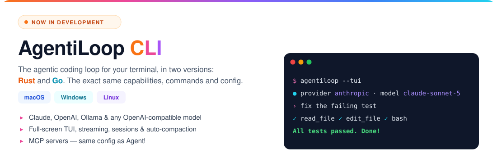

# 🦾 AgentiLoop Agent!

### **A Message from our Sponsor, Fluxion AI**

<a href="https://fluxionai.world/register?source=github&campaign=aiagent&promo=AIAGENT"></a>

[](https://github.com/AgentiLoop/Agent/releases/latest)
[](https://github.com/AgentiLoop/Agent/stargazers)
[](https://github.com/AgentiLoop/Agent/fork)
[](https://github.com/apple)
[](https://www.swift.org)
<a href="https://github.com/sponsors/AgentiLoop"></a>


*Agent! driving Photo Booth via Accessibility — no clicks, no scripts, just "take a photo".*

## 🆕 New Kid on the Block: AgentiLoop CLI ⚡️

**The agentic loop, unleashed in your terminal. Mac. Windows. Linux. Your call.**

Meet the Agent! family's newest members: two cross-platform CLIs with the **exact same capabilities**. Pick your flavor:

<a href="https://github.com/AgentiLoop/AgentiLoopCLI"></a>

*Built by AgentiLoop Agent! for Mac. Yes, the agent wrote its own little siblings.* 🤖✨ Try the pre-release today!

<a href="https://github.com/AgentiLoop/AgentiLoopCLI"></a>
<a href="https://github.com/AgentiLoop/AgentiLoopGo"></a>

## README Translations

[English](README.md) · [Español](README_es.md) · [Français](README_fr.md) · [Deutsch](README_de.md) · [中文 (简体)](README_zh.md) · [Русский](README_ru.md) · [한국어](README_ko.md) · [日本語](README_ja.md)

## Chess within Agent


## What is Agent!?

**One app. Any AI. Total command over your Mac.**

Agent! is a 100% native Swift 6.2 / SwiftUI app that wires **21 LLM providers** — Claude, Codex, OpenAI, Gemini, Grok, Mistral, Mistral Vibe, DeepSeek, Hugging Face, Z.ai, BigModel, Alibaba DashScope, Qwen, Qwen Code, MiniMax, OpenRouter, Requesty, A2Agent, OrcaRouter, Ollama (cloud and local), vLLM, and LM Studio — plus on-device **Apple Intelligence** — into an autonomous task loop that actually *does things*: reads your codebase, fixes the bug, builds the Xcode project, commits the diff, drives any Mac app through the Accessibility API, runs shell commands as you or as root, texts you results over iMessage, and answers to a spoken *"Agent!"*.

No NPM, no Electron, no subscription, no telemetry. Bring your own API key, run fully local, or run free on Apple Intelligence. Every Swift package it depends on was written by the same author. See [Backstory](#backstory) below.

## What's New 🚀

**v1.1.x — The Hardened Harness Release** · [Releases →](https://github.com/AgentiLoop/Agent/releases/latest)

- **Context compaction, rebuilt.** Threshold = model window − reserved output − buffer, driven by real `input_tokens`. Provider-side 9-section LLM summary replaces on-device 4K summaries; open goal, plan checklist and edited files are re-attached after every compaction. Oversized tool results are spilled to disk at emission and recoverable via `restore_tool_result`. 413 overflow routes through forced compaction with a shorter retry; `max_tokens` overruns recover by escalating, then continuing.
- **Read-before-edit gate.** `edit_file` / `apply_diff` / `diff_apply` refuse to touch a file the LLM hasn't read this task, or that changed on disk since the last read (SHA-256). The refusal auto-reads the file so the next call is the edit. External file changes are surfaced each turn as diff snippets.
- **Real context windows for local models.** LM Studio, Ollama and vLLM report their actual per-model context length — no more hardcoded 32K assumption.
- **Faster turns.** Read-only tools start while the Claude response is still streaming; input-aware shell concurrency; jittered exponential retry with `Retry-After` on 429/529; mid-stream SSE errors surfaced on every provider.
- **Defense-in-depth.** `ShellSafetyService` is now enforced daemon-side (AgentHelper + AgentUser) as well as client-side; release builds reject un-teamed XPC clients; both XPC listeners require same-team code signing derived from the app's own signature.
- **Activity log.** No more 50K truncation or 500K relaunch trim — large logs render off-main with a "Processing tab data…" overlay; optional "Activity Log Below HUD" layout.
- **App menu:** Check for Updates… (GitHub releases), Website, GitHub. CI Build & Test workflow on every PR; **273 passing tests**.
- Plus: `goal_state` with evidence-verified criteria, opt-in critic diff review before completion, task-scoped `rewind_task`, extended thinking for Claude, `reasoning_effort` pass-through, sub-agents with per-agent model override (3 concurrent, 6 read-only), typed tool errors with recovery hints, event hooks.

## Quick Start (Download)

1. **Download** [Agent!](https://github.com/AgentiLoop/Agent/releases/latest) and drag to Applications — or with Homebrew:
   ```sh
   brew update && brew install --cask agentiloop-agent
   ```
2. **Open Agent!** — it sets up everything automatically
3. **Pick your AI** — Settings → choose a provider → enter API key

> ✅ **You never need to compile from source.** Every release **and** every pre-release ships a pre-compiled Mac binary (`.dmg` + `.zip`), built by CI and **signed, notarized, and stapled by Apple** with the AgentiLoop Team ID. Because the official binaries carry a real Developer ID, the **Launch Agent and Launch Daemon always register and never get "lost"** — that only happens with ad-hoc source builds (see Option B below). If your helpers disappeared, just install the [latest release binary](https://github.com/AgentiLoop/Agent/releases/latest).

## Quick Start (Build from Source)

> Only needed if you want to hack on Agent! itself. Everyone else: use the signed binary above.

```bash
git clone https://github.com/AgentiLoop/agent.git
cd Agent
```

**Option A — Xcode (Apple Developer account):** open `Agent.xcodeproj`, set your Development Team, Build & Run the `Agent` target, approve the helper when prompted.

**Option B — no developer account (Xcode Command Line Tools only):**
```bash
./build.sh              # Debug
./build.sh Release      # Release
open "build/DerivedData/Build/Products/Debug/Agent!.app"
```

> ⚠️ Option B builds are ad-hoc signed. The Launch Agent/Daemon helpers won't register (SMAppService needs a Team ID), but the LLM loop, all tools, Accessibility, AppleScript, shell, and MCP still work. **Want the helpers without a developer account? Use the signed, notarized release binary — no compiling required.**

> 💡 **Cheap setup:** **GLM-5.3** via **Z.ai** (fastest signup, default model) costs pennies per million tokens. Running locally? Only **GLM-4.7-Turbo** (32B) fits consumer hardware (64–128GB Apple Silicon via Ollama).

### Troubleshooting (Build from Source)

- **`xcode-select` points at Command Line Tools** → `sudo xcode-select -s /Applications/Xcode.app/Contents/Developer`
- **Odd `BUILD FAILED` after pulling** → stale DerivedData: `./build.sh clean && ./build.sh`
- **Helpers never register** → expected on Option B; use Option A, or simply install the [signed release binary](https://github.com/AgentiLoop/Agent/releases/latest) — every release and pre-release ships one
- **Deployment target / SDK errors** → Agent! targets macOS 26; update macOS and Xcode
- **Config argument is case-sensitive** → `./build.sh` (Debug) or `./build.sh Release`

## What Can It Do?

> *"Build the Xcode project and fix any errors"* · *"Play my Workout playlist in Music"* · *"Take a photo with Photo Booth"* · *"Send an iMessage to Mom saying I'll be home at 6"* · *"Open Safari and search for flights to Tokyo"* · *"Refactor this class into smaller files"* · *"What calendar events do I have today?"*

Just type what you want. Agent! figures out how and makes it happen.

---

## Key Features

- **🧠 Self-verifying task loop** — reasons, executes, observes results, self-corrects. A task can't declare itself done until `goal_state` criteria are marked with evidence; an opt-in critic reviews the diff first.
- **🛠 Agentic coding** — reads codebases, edits with string-replace diffs, builds Xcode projects natively (clickable errors), manages git, indexes repos into a portable JSONL repo-map. Every edit is snapshotted — one-click rollback or whole-task `rewind_task`.
- **🖥 Desktop automation** — drives any Mac app through the Accessibility API ([AXorcist](https://github.com/steipete/AXorcist)), element-based with fuzzy auto-retry. Plus NSAppleScript, JXA and 51 ScriptingBridge app bridges, all in-process with TCC.
- **📜 AgentScript** — Swift dylibs compiled at runtime and `dlopen`'d in-process with full TCC. Deleted scripts go to `.Trash` and are restorable.
- **🛡 Privileged execution** — shell as you via a Launch Agent, or as root via a Launch Daemon you approve exactly once (SMAppService + XPC). See [docs/SECURITY.md](docs/SECURITY.md) for why SMAppService already enforces signing identity.
- **🎙 Voice** — say **"Agent!"** followed by your task; on-device `SFSpeechRecognizer`, auto-runs after ~2.5s of silence, loops.
- **📱 iMessage remote control** — text `Agent! next song` from your iPhone; approved senders only. Needs Full Disk Access for `chat.db`.
- **🌐 Web** — built-in Safari automation (JavaScript + AppleScript); optional Selenium and [Playwright MCP](https://github.com/microsoft/playwright-mcp) for cross-browser.
- **🤝 Sub-agents** — up to 3 concurrent (6 read-only) isolated agents with mailbox messaging and per-agent model override.
- **🧩 MCP** — add any MCP server in Settings → MCP Servers; tools appear as `mcp_<server>_<tool>`. Xcode MCP: `{"mcpServers":{"xcode":{"command":"xcrun","args":["mcpbridge"],"transport":"stdio"}}}`.
- **🗂 Tabs, history, memory, plans, skills** — each tab has its own project folder and log; persistent user memory; multi-plan checklists surfaced in every prompt.
- **🔄 Fallback chain** — auto-switch to the next configured provider on 429/timeout/network failure.

## Sponsoring

### Sponsors

<a href="https://fluxionai.world/register?source=github&campaign=aiagent&promo=AIAGENT"></a>

| Sponsor | Level | |
|---|---|---|
| <a href="https://fluxionai.world/register?source=github&campaign=aiagent&promo=AIAGENT"><b>Fluxion&nbsp;AI</b></a> | <a href="https://fluxionai.world/register?source=github&campaign=aiagent&promo=AIAGENT"></a> | Reliable, cost-efficient access to GPT, Claude and other leading AI models through one unified API. Save up to 70% compared with official API pricing, and get $3 in API credits when you sign up through [this link](https://fluxionai.world/register?source=github&campaign=aiagent&promo=AIAGENT) (promo code `AIAGENT`). |

Companies and LLM providers who want to support the project: see [docs/SPONSORSHIP.md](./docs/SPONSORSHIP.md) (levels, placements) and [docs/PROVIDER_PROGRAM.md](./docs/PROVIDER_PROGRAM.md) (LLM provider integration), or sponsor directly via [GitHub Sponsors](https://github.com/sponsors/AgentiLoop). All billing via GitHub Sponsors.

## 🤖 21 LLM Providers

| Provider | Cost | Best for |
|---|---|---|
| **A2Agent** | Cheap | DeepSeek, GLM, Kimi, MiniMax and Qwen via one OpenAI-compatible key at a fraction of official pricing |
| **Apple Intelligence** | Free, on-device | Triage, summaries, token compression (brain icon, not available on the provider picker) |
| **Claude** | Per-token (API key) or subscription (OAuth) | Long autonomous tasks, extended thinking, prompt caching |
| **Codex** | ChatGPT subscription | OpenAI models via ChatGPT OAuth — no API key, no per-token charges |
| <a href="https://fluxionai.world/register?source=github&campaign=aiagent&promo=AIAGENT"><b>Fluxion&nbsp;AI</b></a><br><a href="https://fluxionai.world/register?source=github&campaign=aiagent&promo=AIAGENT"></a> | Up to 70% off official pricing | GPT, Claude, Grok, DeepSeek, Gemini, GLM and Kimi via one key; OpenAI or Anthropic protocol per key group; $3 credit with promo `AIAGENT` |
| **DeepSeek** | Cheap | Budget coding, cache-hit reporting |
| **Google Gemini** | Paid (free tier) | Long context, vision |
| **Grok** (xAI) | Paid | Real-time info |
| **Hugging Face** | Varies | Open models, serverless or dedicated endpoints |
| **Local Ollama** / **vLLM** / **LM Studio** / **oMLX** | Free + hardware | Fully offline; real per-model context window detected |
| **MiniMax** | Cheap | 1M-token context |
| **Mistral** / **Mistral Vibe** | Paid | Open-weight cloud, code, agent product |
| **Ollama** (cloud) | Free tier | Hosted open models |
| **OpenAI** | Paid | General purpose, tool calling, vision, `reasoning_effort` |
| **OpenRouter** | Paid | 200+ models, one key; Claude routed via Anthropic protocol |
| **OrcaRouter** | Paid | 190+ models via one OpenAI-compatible key at provider cost; auto/fusion/fallback routing |
| **Alibaba DashScope** (Model Studio / QwenCloud pay-as-you-go) | Cheap | Qwen 3.8 via DashScope; Model Studio `sk-` and QwenCloud `sk-ws-` keys |
| **Qwen** (qwen.ai Token Plan) | Subscription | QwenCloud Token Plan (`sk-sp-` key, `token-plan.*.maas.aliyuncs.com`): qwen3.8-max, qwen3.7-plus, GLM-5.2, DeepSeek V4 |
| **Qwen Code** | Subscription | Alibaba Coding Plan (`sk-sp-` key): qwen3-coder-plus, qwen3.7-plus, GLM-5, Kimi K2.5, MiniMax-M2.5 |
| **Requesty** | Paid | 300+ models via one OpenAI-compatible key; per-model pricing and capability metadata |
| **Z.ai** / **BigModel** | Cheap | GLM-5.3 — recommended starting point |

> 💡 Self-hosted providers are free only in the API-fee sense — a usable 30B+ model needs an M2/M3/M4 Ultra Mac Studio (64–128GB). Without that hardware, the cheap cloud paths above are dramatically cheaper.

## Tools

Canonical names come from `AgentTools.Name.*` (source of truth: the [AgentTools](https://github.com/AgentiLoop/AgentTools) package). Per-provider toggles can hide individual tools.

| Group | Tools |
|---|---|
| **Core** | `done` · `list_tools` · `search` · `web_search` · `fetch` · `chat` · `memory` · `plan` · `goal_state` · `restore_tool_result` · `directory` · `skill` · `ask_user` · `index` |
| **Code / build** | `file` (read/write/edit/diff_apply/undo/list/search/mkdir/…) · `git` · `xcode` (build/run/analyze/snippet/code_review/add_file/bump_version/…) · `agent_script` |
| **Shell** | `user_shell` (Launch Agent) · `root_shell` (Launch Daemon) · `shell` (in-process fallback) · `batch` · `multi` |
| **macOS automation** | `accessibility` (25 element-based actions) · `applescript` (with `lookup_sdef`) · `javascript` (JXA) |
| **Web** | `safari` · `selenium` · `mcp_playwright_browser_*` (optional) |
| **Sub-agents** | `spawn_agent` · `tell_agent` |

Full per-action reference: [docs/TECHNICAL.md](docs/TECHNICAL.md).

## AgentScript — Swift scripts with full TCC

AgentScripts are plain Swift files in `~/Documents/AgentScript/agents/Sources/Scripts/`. Agent! compiles each one to a `.dylib` with SwiftPM (`Package.swift` lists every script plus the 51 ScriptingBridge app bridges), then `dlopen`s it with Agent!'s own TCC grants — Accessibility, Automation, Calendar, Contacts, Mail, Photos, etc. The LLM manages them with `agent_script` (`create` / `edit` / `run` / `delete` / `restore` / `pull`); ~35 examples ship in the folder (`Hello`, `TodayEvents`, `NowPlaying`, `CheckMail`, `CreateDmg`, `ArchiveXcode`, …).

**Entry point** — no top-level code, no `exit()`; `stdout` is returned to the LLM, the return value is the exit status:

```swift
import Foundation
import CalendarBridge   // any `import XBridge` auto-wires — no Package.swift edits needed

@_cdecl("script_main")
public func scriptMain() -> Int32 {
    print("Hello from AgentScript! 👋")
    return 0
}
```

**Environment variables — how they are SET.** The LLM never touches the environment itself. It calls the tool, and Agent!'s `ScriptService` exports the variables into the script's process (`env["AGENT_PROJECT_FOLDER"] = cwd`, `env["AGENT_SCRIPT_ARGS"] = arguments` in `ScriptService+Execution.swift`; `setenv(...)` for the in-process variant). The same two variables are exported to every `user_shell` / `root_shell` / `shell` command.

```text
LLM tool call                                          What Agent! exports to the script
─────────────────────────────────────────────────────  ─────────────────────────────────────────────
agent_script(action:"run", name:"TodayEvents")         AGENT_PROJECT_FOLDER=/Users/you/Documents/GitHub/Agent
                                                       (AGENT_SCRIPT_ARGS is NOT set)

agent_script(action:"run", name:"TodayEvents",         AGENT_PROJECT_FOLDER=/Users/you/Documents/GitHub/Agent
             arguments:"days=3,location=false,json=true")   AGENT_SCRIPT_ARGS="days=3,location=false,json=true"
```

| Variable | When set | Meaning |
|---|---|---|
| `AGENT_PROJECT_FOLDER` | Always | The active tab's project folder (or `$HOME` if none). The runner's cwd is set to it as well. |
| `AGENT_SCRIPT_ARGS` | Only when the LLM passes `arguments:"…"` | Whatever string the LLM passed, verbatim. The bundled examples use the `key=value,key=value` convention. |

**Environment variables — how they are READ IN.** Inside the script, both come from `ProcessInfo.processInfo.environment`. This is the exact parsing pattern used by `Hello.swift` / `TodayEvents.swift`:

```swift
import Foundation

@_cdecl("script_main")
public func scriptMain() -> Int32 {
    let env = ProcessInfo.processInfo.environment

    // 1. Project folder — always present; fall back to cwd just in case
    let folder = env["AGENT_PROJECT_FOLDER"] ?? FileManager.default.currentDirectoryPath

    // 2. Arguments — absent unless the LLM passed `arguments:"…"`
    let argsString = env["AGENT_SCRIPT_ARGS"] ?? ""

    // 3. Defaults, then parse "key=value,key=value"
    var daysAhead    = 0
    var showLocation = true
    var outputJSON   = false

    for pair in argsString.split(separator: ",") {
        let parts = pair.split(separator: "=", maxSplits: 1).map { $0.trimmingCharacters(in: .whitespaces) }
        guard parts.count == 2 else { continue }
        switch parts[0] {
        case "days":     daysAhead    = Int(parts[1]) ?? 0
        case "location": showLocation = parts[1].lowercased() == "true"
        case "json":     outputJSON   = parts[1].lowercased() == "true"
        default: break
        }
    }

    print("Project folder: \(folder)")
    print("days=\(daysAhead) location=\(showLocation) json=\(outputJSON)")
    return 0
}
```

The two variables are independent — never parse the project folder out of `AGENT_SCRIPT_ARGS`. Bash equivalent inside `user_shell`: `ls "$AGENT_PROJECT_FOLDER/Sources"` (cwd is already there, no `cd` needed).

**Real `AGENT_SCRIPT_ARGS` conventions from the shipped scripts** (`~/Documents/AgentScript/agents/Sources/Scripts/`):

| Script | `arguments:` the LLM passes | Style |
|---|---|---|
| `TodayEvents` | `days=3,location=false,json=true` | `key=value,…` |
| `CheckMail` | `unreadOnly=true,inboxCount=true,json=true` | `key=value,…` |
| `ListReminders` | `completed=false,limit=5` | `key=value,…` |
| `QuitApps` | `excluded=Xcode,Agent,Terminal` | `key=value` with a list |
| `NowPlaying` | `json=true,artwork=true` | `key=value,…` |
| `ArchiveXcode` | `/path/to/Project.xcodeproj MyScheme 469UCUB275` | positional, space-separated (scheme/teamID auto-detected if omitted) |
| `CreateDmg` | `--app /path/to/App.app --output /path/out.dmg --name "My App" --compress` | flag-style, space-separated, quotes respected |

**JSON input / output — a SEPARATE mechanism from the env vars.** Env vars are exported by Agent! into the process; JSON files are plain files on disk that the *script itself* reads and writes with `FileManager` / `JSONSerialization`. Agent! does not create, pass, or parse them. Two real patterns from the shipped scripts:

*1. JSON-only input (`SendMessage`)* — no env args at all; the script requires `SendMessage_input.json` and returns `1` if it's missing:

```json
// ~/Documents/AgentScript/json/SendMessage_input.json   (written by the LLM via file(action:"write") before the run)
{ "recipient": "Mom", "message": "Home at 6", "imagePath": "~/Pictures/Photos Library.photoslibrary/originals/A/IMG_0001.jpeg" }

// ~/Documents/AgentScript/json/SendMessage_output.json  (written by the script)
{ "success": true, "timestamp": "2026-09-03T21:14:02Z", "recipient": "Mom", "message": "Home at 6" }
// on failure: { "success": false, "timestamp": "…", "error": "Missing required field: recipient" }
```

```swift
// SendMessage.swift — how the script reads it
let inputPath  = "\(NSHomeDirectory())/Documents/AgentScript/json/SendMessage_input.json"
guard let inputData = FileManager.default.contents(atPath: inputPath) else {
    writeOutput(outputPath, success: false, error: "Input file not found: \(inputPath)"); return 1
}
guard let json = try? JSONSerialization.jsonObject(with: inputData) as? [String: Any],
      let recipientHandle = json["recipient"] as? String else { /* … */ return 1 }
let message   = json["message"]   as? String
let imagePath = json["imagePath"] as? String
```

*2. Env args for options, JSON for structured output (`TodayEvents`, `NowPlaying`, `CheckMail`, `ListReminders`)* — options come from `AGENT_SCRIPT_ARGS` (or the optional `<Name>_input.json`); when `json=true` the script writes `<Name>_output.json` in addition to the human-readable stdout that goes back to the LLM:

```json
// agent_script(action:"run", name:"TodayEvents", arguments:"days=3,json=true")
// → ~/Documents/AgentScript/json/TodayEvents_output.json
{ "success": true, "timestamp": "…", "count": 2,
  "events": [ { "summary": "Standup", "calendar": "Work", "startTime": "…", "endTime": "…", "allDay": false, "location": "…" }, … ] }

// agent_script(action:"run", name:"NowPlaying", arguments:"json=true,artwork=true")
// → ~/Documents/AgentScript/json/NowPlaying_output.json
{ "success": true, "playerState": "playing",
  "track": { "name": "…", "artist": "…", "album": "…", "duration": 240 },
  "artwork": { "saved": true, "path": "~/Documents/AgentScript/images/….png", "width": 500, "height": 500 } }
```

```swift
// TodayEvents.swift — how the script writes it
func writeTodayEventsOutput(_ path: String, success: Bool, error: String? = nil,
                            events: [[String: Any]]? = nil, count: Int? = nil, outputJSON: Bool) {
    guard outputJSON else { return }
    var result: [String: Any] = ["success": success, "timestamp": ISO8601DateFormatter().string(from: Date())]
    if !success, let error { result["error"] = error }
    if success { if let events { result["events"] = events }; if let count { result["count"] = count } }
    try? FileManager.default.createDirectory(atPath: (path as NSString).deletingLastPathComponent, withIntermediateDirectories: true)
    if let out = try? JSONSerialization.data(withJSONObject: result, options: .prettyPrinted) {
        try? out.write(to: URL(fileURLWithPath: path))
    }
}
```

Deleted scripts go to `~/Documents/AgentScript/agents/.Trash/` (`agent_script(action:"restore")`); `action:"pull"` fetches the upstream version from the [AgentScripts](https://github.com/AgentiLoop/AgentScripts) repo.

## 🔒 Jev — a second opinion before shell commands

**Jev** (TypeSafe System One) is an optional decision layer that reviews shell commands *before* Agent! runs them. It supplements your selected LLM provider — it never replaces it.

- **What it does.** Every command that already passed the hard-coded `ShellSafetyService` rules is sent to Jev, which rates how likely it is to irreversibly destroy data. Above your threshold the command is refused with the rating and the command text; below it, the command runs.
- **Where it applies.** All shell paths: the in-process shell, the user Launch Agent (`user_shell`), and the privileged Launch Daemon (`root_shell`).
- **Tunable cut-off.** Settings → LLM Common Settings → **Reject at … % destructive**, 0–100% in 10% steps. Default **70%**.
- **Fail-open by design.** No API key, the **Consult Jev before tools** toggle off, or a TypeSafe outage means "no opinion" — the command proceeds and the failure is logged, never silently treated as a safe verdict. Cancelling a task during a Jev check stops the command.
- **Visible.** Every check logs the destructive-risk percentage, the allowed/refused verdict, the answering model, and input/output token counts.
- **Configuration.** API key (stored in the Keychain), model picker with catalog refresh, and the advisory toggle all live in LLM Common Settings. The client lives in the bundled `TypeSafeKit` / `TypeSafeMiddleware` Swift package.

## Privacy & Safety

Your files, screen contents and personal data never leave your Mac — cloud providers only see prompt text; local providers keep everything offline. Every action is logged.

| Layer | What it does |
|---|---|
| **Shell Safety Service** | Hard-blocks `rm -rf /`, `rm -rf ~`, bare-glob `rm -rf`, `--no-preserve-root` — enforced client-side **and** daemon-side. Cannot be bypassed by the LLM. |
| **XPC client trust** | Both listeners require same-team code signing derived from the app's own signature; release builds reject un-teamed clients. |
| **Read-before-edit gate** | Edits to unread or externally-modified files are refused (SHA-256), with auto-read on refusal. |
| **File backups + rewind** | Every edit snapshotted (1-week TTL); Rollback UI, `file(action:"undo")`, or task-scoped `rewind_task`. |
| **TCC in-process routing** | AppleScript/JXA/screencapture/accessibility commands run in-process where Agent! holds TCC grants, never through the daemons. |
| **Tool execution gating** | The LLM cannot fabricate results — every call flows through `dispatchTool()` and returns real output. Tool-less "I clicked/searched…" claims get a correction injected. |
| **Typed errors + guards** | Every failing tool result carries a recovery hint; broken-record and stuck guards nudge, then stop; completion gates cap refusals at 3 per task. |
| **Console audit trail** | Every tool call and every helper command is logged. |

## Keyboard Shortcuts & Slash Commands

| Shortcut | Action |
|---|---|
| `Return` | Run task · `⌘ .` / `Esc` cancel |
| `⌘ T` / `⌘ W` / `⌘ 1–9` / `⌘ ⇧ ←→` | New / close / switch / prev-next tab |
| `⌘ B` / `⌘ D` | Toggle LLM Output overlay / chevrons |
| `⌘ F` / `⌘ L` / `⌘ V` | Search log / clear log / paste image |
| `↑` / `↓` | Prompt history |
| `⌘ ⇧ M` / `⌘ ⇧ P` | Messages Monitor / Settings |
| `⌘ ⇧ K` `L` `H` `J` `U` | Clear all / LLM panel / prompt history / task history / token counters |

Slash commands run locally: `/clear [log|all|llm|history|tasks|tokens]`, `/memory [show|clear|edit|<text>]`.

## FAQ

**Do I need to know how to code?** No — plain English (or your native language).
**How much does it cost?** The app is free for noncommercial and personal use (PolyForm Noncommercial 1.0.0). You pay your provider; GLM-5.3 via Z.ai/BigModel or DeepSeek are the cheapest for serious work. Local models are free if you own the hardware.
**What Mac do I need?** Apple Silicon, macOS 26.4.1+. Any modern Mac for cloud providers; 64GB+ for 30B local models.
**How is this different from Siri?** Siri answers. Agent! *acts* — apps, files, code, system.

More: [docs/FAQ.md](docs/FAQ.md) · [Technical Architecture](docs/TECHNICAL.md) · [Comparisons](docs/COMPARISON.md) (vs Claude Code, Cursor, Cline, OpenClaw) · [Security Model](docs/SECURITY.md)

## Backstory

Agent! is the result of three years of building agentic AI apps — ANIE, Game Changer, BattleScript, XCF MCP Server and Client, D1F, and about eight original Swift packages. The missing piece was an intelligent autonomous loop; once achieved, the best of those projects came together into Agent!. It has written video games ([Boss-Man](https://github.com/AgentiLoop/bossman)), created apps, written poetry into Pages via AppleScript, generated disk images and attached them to GitHub releases. Where Claude Code relies on ~65 third-party NPM packages, Agent! is 100% native, uses very little RAM, and ships Xcode automation, Swift Syntax 6.2 analysis, Accessibility, AppleScript, AgentScript/ScriptingBridge, Safari automation and MCP support out of the box.

## Contributing

See [CONTRIBUTING.md](./CONTRIBUTING.md) — build from source in ~5 minutes with `./build.sh`, no developer account needed. Pull requests run the CI Build & Test workflow and require a one-time [CLA signature](./CLA.md). Check the [good first issues](https://github.com/AgentiLoop/Agent/issues?q=is%3Aissue+is%3Aopen+label%3A%22good+first+issue%22).

## License

[PolyForm Noncommercial 1.0.0](./LICENSE). You may use, modify, and share this software for noncommercial and personal purposes. Commercial use — including building or distributing commercial versions — is reserved exclusively to AgentiLoop.ai, a Logos InkPen LLC company. Contact AgentiLoop for a commercial license.

---

> ⚠️ **Legal Notice & Attribution**
>
> ### Trademark Notice
>
> "AgentiLoop Agent! for Mac" is an independent software project and is **not** affiliated with, endorsed by, sponsored by, or otherwise associated with Apple Inc. "Apple," "Mac," "Mac mini," "MacBook," "macOS," and related marks are trademarks of Apple Inc., registered in the U.S. and other countries. All other trademarks, service marks, and trade names referenced herein are the property of their respective owners and are used for identification purposes only.
>
> "AgentiLoop Agent!" and the AgentiLoop Agent! logo are trademarks of AgentiLoop.ai, a Logos InkPen LLC company. Use of these marks requires prior written permission. The PolyForm Noncommercial license below grants rights to the source code only — it does **not** grant any trademark rights.
>
> ### Source Code License (PolyForm Noncommercial 1.0.0)
>
> The source code of "AgentiLoop Agent! for Mac" is source-available and licensed under the **PolyForm Noncommercial License 1.0.0**. You are free to use, copy, modify, and distribute the source code for any noncommercial purpose, subject to the conditions in the [LICENSE](./LICENSE) file (retain the Required Notice and a copy of, or link to, the license terms). Commercial use and commercial versions of the software are reserved exclusively to AgentiLoop.ai, a Logos InkPen LLC company.
>
> ### Compiled Binaries & Releases
>
> Compiled binaries, installers, code-signed builds, and release artifacts distributed through this project's GitHub Releases, [AgentiLoop.ai](https://AgentiLoop.ai), or any other official channel are the copyrighted work of AgentiLoop.ai, a Logos InkPen LLC company and are **not** covered by the PolyForm Noncommercial license that governs the source code. All rights to the official binaries — including the "AgentiLoop Agent!" name, logo, code-signing identity, and Developer ID — are reserved.
>
> Copyright © 2026 AgentiLoop.ai, a Logos InkPen LLC company. All rights reserved.
>
> You are welcome to build your own binaries from source for noncommercial use under the PolyForm Noncommercial license, provided you do not use the "AgentiLoop Agent!" name, logo, or branding to identify your product.
>
> ### Warranty Disclaimer
>
> This software is provided **"AS IS,"** without warranty of any kind, express or implied, including but not limited to the warranties of merchantability, fitness for a particular purpose, and non-infringement. In no event shall the author or copyright holder be liable for any claim, damages, or other liability, whether in an action of contract, tort, or otherwise, arising from, out of, or in connection with the software or the use or other dealings in the software.
>
> ---
>
> Thank you for your interest in AgentiLoop Agent! — an application crafted for Mac mini, MacBook, and Mac studio computers running macOS 26.4 or later on genuine Mac hardware and software.
>
> - Website: https://AgentiLoop.ai
> - Github : https://github.com/AgentiLoop/agent

### **A Message from our Sponsor, Fluxion AI**

<a href="https://fluxionai.world/register?source=github&campaign=aiagent&promo=AIAGENT"></a>
