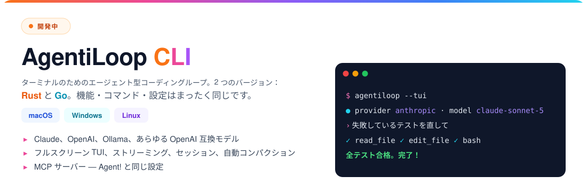

<a href="https://fluxionai.world/register?source=github&campaign=aiagent&promo=AIAGENT"></a>

# 🦾 AgentiLoop Agent!

[](https://github.com/AgentiLoop/Agent/releases/latest)
[](https://github.com/AgentiLoop/Agent/stargazers)
[](https://github.com/AgentiLoop/Agent/fork)
[](https://github.com/apple)
[](https://www.swift.org)
<a href="https://github.com/sponsors/AgentiLoop"></a>

## 🆕 期待の新星：AgentiLoop CLI ⚡️

**エージェントループを、あなたのターミナルで解き放て。Mac、Windows、Linux、お好きなものを。**

Agent! ファミリーの新メンバーを紹介します。**まったく同じ機能**を持つ 2 つのクロスプラットフォーム CLI です。好きな方を選んでください：

<a href="https://github.com/AgentiLoop/AgentiLoopCLI"></a>

*AgentiLoop Agent! for Mac で作られました。そう、エージェントが自分の弟分を書き上げたのです。* 🤖✨ 今すぐプレリリース版をお試しください！

<a href="https://github.com/AgentiLoop/AgentiLoopCLI"></a>
<a href="https://github.com/AgentiLoop/AgentiLoopGo"></a>

## README 翻訳

[English](README.md) · [Español](README_es.md) · [Français](README_fr.md) · [Deutsch](README_de.md) · [中文 (简体)](README_zh.md) · [Русский](README_ru.md) · [한국어](README_ko.md) · [日本語](README_ja.md)

## Agent の中でチェス


## Agent! とは？

**一つのアプリ。どんな AI でも。Mac を完全に掌握。**

Agent! は 100% ネイティブの Swift 6.2 / SwiftUI アプリで、**23 の LLM プロバイダー** — Claude、Codex、OpenAI、Gemini、Grok、Mistral、Mistral Vibe、DeepSeek、Hugging Face、Z.ai、BigModel、Alibaba DashScope、Qwen、Qwen Code、MiniMax、OpenRouter、Requesty、A2Agent、OrcaRouter、Ollama（クラウドおよびローカル）、vLLM、LM Studio、oMLX — に加えてオンデバイスの **Apple Intelligence** を、実際に*物事を成し遂げる*自律タスクループへとつなぎます：コードベースを読み、バグを修正し、Xcode プロジェクトをビルドし、diff をコミットし、アクセシビリティ API であらゆる Mac アプリを操作し、あなたまたは root としてシェルコマンドを実行し、iMessage で結果を送り、話しかけた*「Agent!」*に応答します。

NPM も Electron もサブスクリプションもテレメトリもありません。自分の API キーを使うか、完全にローカルで実行するか、Apple Intelligence で無料で実行してください。依存するすべての Swift パッケージは同じ作者が書きました。下の[背景](#背景)をご覧ください。

## 新機能 🚀

**v1.1.x — The Hardened Harness Release** · [リリース →](https://github.com/AgentiLoop/Agent/releases/latest)

- **コンテキスト圧縮を再構築。** しきい値 = モデルウィンドウ − 予約出力 − バッファ、実際の `input_tokens` に基づく。プロバイダー側の 9 セクション LLM 要約がオンデバイスの 4K 要約を置き換え。開いている目標、計画チェックリスト、編集済みファイルは圧縮のたびに再添付されます。巨大なツール結果は出力時にディスクへ退避され、`restore_tool_result` で復元可能。413 オーバーフローは強制圧縮と短い再試行を経由し、`max_tokens` 超過はエスカレーション後に継続して復旧します。
- **編集前読み取りゲート。** `edit_file` / `apply_diff` / `diff_apply` は、このタスクで LLM が読んでいないファイル、または最後の読み取り以降にディスク上で変更された（SHA-256）ファイルには触れません。拒否時にファイルを自動で読み取るので、次の呼び出しがそのまま編集になります。外部からのファイル変更は毎ターン diff スニペットとして表示されます。
- **ローカルモデルの実際のコンテキストウィンドウ。** LM Studio、Ollama、vLLM がモデルごとの実際のコンテキスト長を報告 — ハードコードされた 32K の仮定はもうありません。
- **より速いターン。** 読み取り専用ツールは Claude のレスポンスがストリーミング中に開始。入力を考慮したシェル並列実行。429/529 では `Retry-After` を尊重するジッター付き指数リトライ。すべてのプロバイダーでストリーム途中の SSE エラーを表示。
- **多層防御。** `ShellSafetyService` がクライアント側に加えてデーモン側（AgentHelper + AgentUser）でも強制。リリースビルドはチーム未設定の XPC クライアントを拒否。両 XPC リスナーはアプリ自身の署名から導出した同一チームのコード署名を要求します。
- **アクティビティログ。** 50K での切り捨てや 500K での再起動時トリムはもうありません — 大きなログは「Processing tab data…」オーバーレイとともにメインスレッド外で描画。オプションの「Activity Log Below HUD」レイアウト。
- **アプリメニュー：** アップデートを確認…（GitHub リリース）、Web サイト、GitHub。すべての PR で CI Build & Test ワークフロー。**273 件のテストがパス**。
- さらに：証拠で検証される基準を持つ `goal_state`、完了前のオプトイン批評 diff レビュー、タスク単位の `rewind_task`、Claude の拡張思考、`reasoning_effort` パススルー、エージェントごとのモデル上書きが可能なサブエージェント（同時 3、読み取り専用 6）、復旧ヒント付きの型付きツールエラー、イベントフック。

## クイックスタート（ダウンロード）

1. [Agent!](https://github.com/AgentiLoop/Agent/releases/latest) を**ダウンロード**してアプリケーションにドラッグ — または Homebrew で：
   ```sh
   brew update && brew install --cask agentiloop-agent
   ```
2. **Agent! を開く** — すべて自動で設定されます
3. **AI を選ぶ** — 設定 → プロバイダーを選択 → API キーを入力

> ✅ **ソースからコンパイルする必要は一切ありません。** すべてのリリース**および**すべてのプレリリースには、CI がビルドし、AgentiLoop の Team ID で **Apple により署名・公証（notarize）・ステープル（staple）された**コンパイル済み Mac バイナリ（`.dmg` + `.zip`）が付属します。公式バイナリは本物の Developer ID を持つため、**Launch Agent と Launch Daemon は常に登録され、決して「失われ」ません** — それが起こるのはアドホック署名のソースビルドだけです（下のオプション B を参照）。ヘルパーが消えてしまった場合は、[最新リリースのバイナリ](https://github.com/AgentiLoop/Agent/releases/latest)をインストールするだけです。

## クイックスタート（ソースからビルド）

> Agent! 自体に手を入れたい場合にのみ必要です。それ以外の方は、上の署名済みバイナリをお使いください。

```bash
git clone https://github.com/AgentiLoop/agent.git
cd Agent
```

**オプション A — Xcode（Apple Developer アカウント）：** `Agent.xcodeproj` を開き、Development Team を設定し、`Agent` ターゲットを Build & Run し、プロンプトが出たらヘルパーを承認します。

**オプション B — 開発者アカウントなし（Xcode Command Line Tools のみ）：**
```bash
./build.sh              # Debug
./build.sh Release      # Release
open "build/DerivedData/Build/Products/Debug/Agent!.app"
```

> ⚠️ オプション B のビルドはアドホック署名です。Launch Agent/Daemon ヘルパーは登録されません（SMAppService には Team ID が必要）が、LLM ループ、すべてのツール、アクセシビリティ、AppleScript、シェル、MCP は引き続き動作します。**開発者アカウントなしでヘルパーを使いたい？ 署名・公証済みのリリースバイナリを使ってください — コンパイル不要です。**

> 💡 **安価なセットアップ：** **Z.ai** 経由の **GLM-5.3**（最速のサインアップ、デフォルトモデル）は 100 万トークンあたり数セントです。ローカルで実行？ **GLM-4.7-Turbo**（32B）だけがコンシューマー向けハードウェア（Ollama 経由で 64〜128GB の Apple Silicon）に収まります。

### トラブルシューティング（ソースからビルド）

- **`xcode-select` が Command Line Tools を指している** → `sudo xcode-select -s /Applications/Xcode.app/Contents/Developer`
- **pull 後に奇妙な `BUILD FAILED`** → 古い DerivedData：`./build.sh clean && ./build.sh`
- **ヘルパーが登録されない** → オプション B では想定どおり。オプション A を使うか、[署名済みリリースバイナリ](https://github.com/AgentiLoop/Agent/releases/latest)をインストールしてください — すべてのリリースとプレリリースに付属します
- **Deployment target / SDK エラー** → Agent! は macOS 26 をターゲットにしています。macOS と Xcode を更新してください
- **設定引数は大文字小文字を区別** → `./build.sh`（Debug）または `./build.sh Release`

## 何ができる？

> *「Xcode プロジェクトをビルドしてエラーを全部直して」* · *「ミュージックで Workout プレイリストを再生して」* · *「Photo Booth で写真を撮って」* · *「6 時に帰るとママに iMessage を送って」* · *「Safari を開いて東京行きの航空券を検索して」* · *「このクラスを小さいファイルにリファクタリングして」* · *「今日のカレンダーの予定は？」*

やりたいことを入力するだけ。Agent! が方法を見つけて実現します。

---

## 主な機能

- **🧠 自己検証タスクループ** — 推論し、実行し、結果を観察し、自己修正します。`goal_state` の基準が証拠付きでマークされるまでタスクは完了を宣言できず、オプトインの批評家が先に diff をレビューします。
- **🛠 エージェント型コーディング** — コードベースを読み、文字列置換 diff で編集し、Xcode プロジェクトをネイティブにビルド（クリック可能なエラー）し、git を管理し、リポジトリをポータブルな JSONL リポマップにインデックス化。すべての編集はスナップショットされます — ワンクリックロールバックまたはタスク全体の `rewind_task`。
- **🖥 デスクトップ自動化** — アクセシビリティ API（[AXorcist](https://github.com/steipete/AXorcist)）であらゆる Mac アプリを操作、ファジー自動リトライ付きの要素ベース。さらに NSAppleScript、JXA、51 の ScriptingBridge アプリブリッジ — すべて TCC 付きのインプロセス。
- **📜 AgentScript** — 実行時にコンパイルされ、完全な TCC でインプロセスに `dlopen` される Swift dylib。削除されたスクリプトは `.Trash` に移動し復元可能です。
- **🛡 特権実行** — Launch Agent 経由であなたとしてシェル、または一度だけ承認する Launch Daemon 経由で root としてシェル（SMAppService + XPC）。SMAppService がすでに署名アイデンティティを強制する理由は [docs/SECURITY.md](docs/SECURITY.md) をご覧ください。
- **🎙 音声** — **「Agent!」**と言ってからタスクを話す。オンデバイスの `SFSpeechRecognizer`、約 2.5 秒の無音後に自動実行、ループします。
- **📱 iMessage リモートコントロール** — iPhone から `Agent! next song` とテキスト送信。承認済み送信者のみ。`chat.db` のためにフルディスクアクセスが必要です。
- **🌐 Web** — 内蔵 Safari 自動化（JavaScript + AppleScript）。クロスブラウザ向けにオプションの Selenium と [Playwright MCP](https://github.com/microsoft/playwright-mcp)。
- **🤝 サブエージェント** — メールボックスメッセージングとエージェントごとのモデル上書きを持つ、最大 3 同時（読み取り専用 6）の分離エージェント。
- **🧩 MCP** — 設定 → MCP Servers で任意の MCP サーバーを追加。ツールは `mcp_<server>_<tool>` として表示されます。Xcode MCP：`{"mcpServers":{"xcode":{"command":"xcrun","args":["mcpbridge"],"transport":"stdio"}}}`。
- **🗂 タブ、履歴、メモリ、計画、スキル** — 各タブは独自のプロジェクトフォルダとログを持ちます。永続的なユーザーメモリ。すべてのプロンプトに表示されるマルチプラン チェックリスト。
- **🔄 フォールバックチェーン** — 429/タイムアウト/ネットワーク障害時に次に設定されたプロバイダーへ自動切り替え。

### スポンサー

<a href="https://fluxionai.world/register?source=github&campaign=aiagent&promo=AIAGENT"></a>

| スポンサー | &nbsp;&nbsp;&nbsp;レベル&nbsp;&nbsp;&nbsp; | |
|---|:---:|---|
| <a href="https://fluxionai.world/register?source=github&campaign=aiagent&promo=AIAGENT"><b>Fluxion&nbsp;AI</b></a> |  | GPT、Claude をはじめとする主要な AI モデルに、ひとつの統合 API で信頼性が高く低コストにアクセスできます。公式 API 価格と比べて最大 70% 節約でき、[こちらのリンク](https://fluxionai.world/register?source=github&campaign=aiagent&promo=AIAGENT)から登録すると $3 分の API クレジットがもらえます（プロモコード `AIAGENT`）。 |

## スポンサーシップ

プロジェクトを支援したい企業や LLM プロバイダーの方は、[docs/SPONSORSHIP.md](./docs/SPONSORSHIP.md)（レベル、掲載場所）と [docs/PROVIDER_PROGRAM.md](./docs/PROVIDER_PROGRAM.md)（LLM プロバイダー連携）をご覧いただくか、[GitHub Sponsors](https://github.com/sponsors/AgentiLoop) から直接スポンサーになってください。請求はすべて GitHub Sponsors 経由です。

## 🤖 23 の LLM プロバイダー

| プロバイダー | &nbsp;&nbsp;&nbsp;スポンサー&nbsp;&nbsp;&nbsp; | コスト | 最適な用途 |
|---|:---:|---|---|
| **A2Agent** | | 安価 | 一つの OpenAI 互換キーで公式価格の一部で DeepSeek、GLM、Kimi、MiniMax、Qwen |
| **Apple Intelligence** | | 無料、オンデバイス | トリアージ、要約、トークン圧縮（脳アイコン、プロバイダーピッカーにはなし） |
| **Claude** | | トークン単位（API キー）またはサブスクリプション（OAuth） | 長い自律タスク、拡張思考、プロンプトキャッシング |
| **Codex** | | ChatGPT サブスクリプション | ChatGPT OAuth 経由の OpenAI モデル — API キー不要、トークン課金なし |
| <a href="https://fluxionai.world/register?source=github&campaign=aiagent&promo=AIAGENT">&nbsp;<b>Fluxion&nbsp;AI</b></a> |  | 公式価格から最大 70% オフ | GPT、Claude、Grok、DeepSeek、Gemini、GLM、Kimi をひとつのキーで。キーグループごとに OpenAI または Anthropic プロトコル。プロモコード `AIAGENT` で $3 クレジット |
| **DeepSeek** | | 安価 | 低予算コーディング、キャッシュヒット報告 |
| **Google Gemini** | | 有料（無料枠あり） | 長いコンテキスト、ビジョン |
| **Grok**（xAI） | | 有料 | リアルタイム情報 |
| **Hugging Face** | | さまざま | オープンモデル、サーバーレスまたは専用エンドポイント |
| **ローカル Ollama** / **vLLM** / **LM Studio** / **oMLX** | | 無料 + ハードウェア | 完全オフライン。モデルごとの実際のコンテキストウィンドウを検出 |
| **MiniMax** | | 安価 | 1M トークンコンテキスト |
| **Mistral** / **Mistral Vibe** | | 有料 | オープンウェイトクラウド、コード、エージェント製品 |
| **Ollama**（クラウド） | | 無料枠 | ホスト型オープンモデル |
| **OpenAI** | | 有料 | 汎用、ツール呼び出し、ビジョン、`reasoning_effort` |
| **OpenRouter** | | 有料 | 200 以上のモデル、一つのキー。Claude は Anthropic プロトコル経由でルーティング |
| **OrcaRouter** | | 有料 | 一つの OpenAI 互換キーでプロバイダー原価の 190 以上のモデル。auto/fusion/fallback ルーティング |
| **Alibaba DashScope** | | 安価 | DashScope 経由の Qwen 3.8。Model Studio `sk-` および QwenCloud `sk-ws-` キー |
| **Qwen**（qwen.ai Token Plan） | | サブスクリプション | QwenCloud Token Plan（`sk-sp-` キー、`token-plan.*.maas.aliyuncs.com`）：qwen3.8-max、qwen3.7-plus、GLM-5.2、DeepSeek V4 |
| **Qwen Code** | | サブスクリプション | Alibaba Coding Plan（`sk-sp-` キー）：qwen3-coder-plus、qwen3.7-plus、GLM-5、Kimi K2.5、MiniMax-M2.5 |
| **Requesty** | | 有料 | 一つの OpenAI 互換キーで 300 以上のモデル。モデルごとの価格と機能メタデータ |
| **Z.ai** / **BigModel** | | 安価 | GLM-5.3 — 推奨の出発点 |

> 💡 セルフホストのプロバイダーは API 料金の意味でのみ無料です — 実用的な 30B+ モデルには M2/M3/M4 Ultra の Mac Studio（64〜128GB）が必要です。そのハードウェアがなければ、上の安価なクラウド経路のほうが圧倒的に安くなります。

## ツール

正式名は `AgentTools.Name.*` に由来します（情報源：[AgentTools](https://github.com/AgentiLoop/AgentTools) パッケージ）。プロバイダーごとのトグルで個々のツールを非表示にできます。

| グループ | ツール |
|---|---|
| **Core** | `done` · `list_tools` · `search` · `web_search` · `fetch` · `chat` · `memory` · `plan` · `goal_state` · `restore_tool_result` · `directory` · `skill` · `ask_user` · `index` |
| **コード / ビルド** | `file`（read/write/edit/diff_apply/undo/list/search/mkdir/…）· `git` · `xcode`（build/run/analyze/snippet/code_review/add_file/bump_version/…）· `agent_script` |
| **シェル** | `user_shell`（Launch Agent）· `root_shell`（Launch Daemon）· `shell`（インプロセスのフォールバック）· `batch` · `multi` |
| **macOS 自動化** | `accessibility`（25 の要素ベースのアクション）· `applescript`（`lookup_sdef` 付き）· `javascript`（JXA） |
| **Web** | `safari` · `selenium` · `mcp_playwright_browser_*`（オプション） |
| **サブエージェント** | `spawn_agent` · `tell_agent` |

アクションごとの完全なリファレンス：[docs/TECHNICAL.md](docs/TECHNICAL.md)。

## AgentScript — 完全な TCC を持つ Swift スクリプト

AgentScript は `~/Documents/AgentScript/agents/Sources/Scripts/` にある普通の Swift ファイルです。Agent! はそれぞれを SwiftPM で `.dylib` にコンパイルし（`Package.swift` はすべてのスクリプトと 51 の ScriptingBridge アプリブリッジを列挙）、Agent! 自身の TCC 許可 — アクセシビリティ、オートメーション、カレンダー、連絡先、メール、写真など — で `dlopen` します。LLM は `agent_script`（`create` / `edit` / `run` / `delete` / `restore` / `pull`）で管理します。フォルダには約 35 の例が同梱されています（`Hello`、`TodayEvents`、`NowPlaying`、`CheckMail`、`CreateDmg`、`ArchiveXcode`、…）。

**エントリーポイント** — トップレベルコードなし、`exit()` なし。`stdout` は LLM に返され、戻り値が終了ステータスです：

```swift
import Foundation
import CalendarBridge   // どの `import XBridge` も自動配線 — Package.swift の編集不要

@_cdecl("script_main")
public func scriptMain() -> Int32 {
    print("Hello from AgentScript! 👋")
    return 0
}
```

**環境変数 — どのように設定されるか。** LLM は環境自体には決して触れません。ツールを呼び出すと、Agent! の `ScriptService` が変数をスクリプトのプロセスにエクスポートします（`ScriptService+Execution.swift` の `env["AGENT_PROJECT_FOLDER"] = cwd`、`env["AGENT_SCRIPT_ARGS"] = arguments`。インプロセス版は `setenv(...)`）。同じ 2 つの変数がすべての `user_shell` / `root_shell` / `shell` コマンドにもエクスポートされます。

```text
LLM ツール呼び出し                                     Agent! がスクリプトにエクスポートするもの
─────────────────────────────────────────────────────  ─────────────────────────────────────────────
agent_script(action:"run", name:"TodayEvents")         AGENT_PROJECT_FOLDER=/Users/you/Documents/GitHub/Agent
                                                       (AGENT_SCRIPT_ARGS は設定されない)

agent_script(action:"run", name:"TodayEvents",         AGENT_PROJECT_FOLDER=/Users/you/Documents/GitHub/Agent
             arguments:"days=3,location=false,json=true")   AGENT_SCRIPT_ARGS="days=3,location=false,json=true"
```

| 変数 | 設定されるとき | 意味 |
|---|---|---|
| `AGENT_PROJECT_FOLDER` | 常に | アクティブなタブのプロジェクトフォルダ（なければ `$HOME`）。ランナーの cwd もここに設定されます。 |
| `AGENT_SCRIPT_ARGS` | LLM が `arguments:"…"` を渡したときのみ | LLM が渡した文字列そのまま。同梱の例は `key=value,key=value` 規約を使います。 |

**環境変数 — どのように読み取るか。** スクリプト内では両方とも `ProcessInfo.processInfo.environment` から取得します。これは `Hello.swift` / `TodayEvents.swift` が使う正確なパースパターンです：

```swift
import Foundation

@_cdecl("script_main")
public func scriptMain() -> Int32 {
    let env = ProcessInfo.processInfo.environment

    // 1. プロジェクトフォルダ — 常に存在。念のため cwd にフォールバック
    let folder = env["AGENT_PROJECT_FOLDER"] ?? FileManager.default.currentDirectoryPath

    // 2. 引数 — LLM が `arguments:"…"` を渡さない限り存在しない
    let argsString = env["AGENT_SCRIPT_ARGS"] ?? ""

    // 3. デフォルト値、そして "key=value,key=value" をパース
    var daysAhead    = 0
    var showLocation = true
    var outputJSON   = false

    for pair in argsString.split(separator: ",") {
        let parts = pair.split(separator: "=", maxSplits: 1).map { $0.trimmingCharacters(in: .whitespaces) }
        guard parts.count == 2 else { continue }
        switch parts[0] {
        case "days":     daysAhead    = Int(parts[1]) ?? 0
        case "location": showLocation = parts[1].lowercased() == "true"
        case "json":     outputJSON   = parts[1].lowercased() == "true"
        default: break
        }
    }

    print("Project folder: \(folder)")
    print("days=\(daysAhead) location=\(showLocation) json=\(outputJSON)")
    return 0
}
```

2 つの変数は独立しています — `AGENT_SCRIPT_ARGS` からプロジェクトフォルダをパースしてはいけません。`user_shell` 内の Bash 相当：`ls "$AGENT_PROJECT_FOLDER/Sources"`（cwd はすでにそこなので `cd` 不要）。

**同梱スクリプトの実際の `AGENT_SCRIPT_ARGS` 規約**（`~/Documents/AgentScript/agents/Sources/Scripts/`）：

| スクリプト | LLM が渡す `arguments:` | スタイル |
|---|---|---|
| `TodayEvents` | `days=3,location=false,json=true` | `key=value,…` |
| `CheckMail` | `unreadOnly=true,inboxCount=true,json=true` | `key=value,…` |
| `ListReminders` | `completed=false,limit=5` | `key=value,…` |
| `QuitApps` | `excluded=Xcode,Agent,Terminal` | リスト付きの `key=value` |
| `NowPlaying` | `json=true,artwork=true` | `key=value,…` |
| `ArchiveXcode` | `/path/to/Project.xcodeproj MyScheme 469UCUB275` | 位置引数、スペース区切り（scheme/teamID は省略時に自動検出） |
| `CreateDmg` | `--app /path/to/App.app --output /path/out.dmg --name "My App" --compress` | フラグ形式、スペース区切り、引用符を尊重 |

**JSON 入出力 — 環境変数とは別のメカニズム。** 環境変数は Agent! がプロセスにエクスポートするもの。JSON ファイルは*スクリプト自身*が `FileManager` / `JSONSerialization` で読み書きするディスク上の普通のファイルです。Agent! はそれらを作成も受け渡しもパースもしません。同梱スクリプトの 2 つの実際のパターン：

*1. JSON のみの入力（`SendMessage`）* — env 引数は一切なし。スクリプトは `SendMessage_input.json` を要求し、なければ `1` を返します：

```json
// ~/Documents/AgentScript/json/SendMessage_input.json   (実行前に LLM が file(action:"write") で書く)
{ "recipient": "Mom", "message": "Home at 6", "imagePath": "~/Pictures/Photos Library.photoslibrary/originals/A/IMG_0001.jpeg" }

// ~/Documents/AgentScript/json/SendMessage_output.json  (スクリプトが書く)
{ "success": true, "timestamp": "2026-09-03T21:14:02Z", "recipient": "Mom", "message": "Home at 6" }
// 失敗時: { "success": false, "timestamp": "…", "error": "Missing required field: recipient" }
```

```swift
// SendMessage.swift — スクリプトの読み取り方
let inputPath  = "\(NSHomeDirectory())/Documents/AgentScript/json/SendMessage_input.json"
guard let inputData = FileManager.default.contents(atPath: inputPath) else {
    writeOutput(outputPath, success: false, error: "Input file not found: \(inputPath)"); return 1
}
guard let json = try? JSONSerialization.jsonObject(with: inputData) as? [String: Any],
      let recipientHandle = json["recipient"] as? String else { /* … */ return 1 }
let message   = json["message"]   as? String
let imagePath = json["imagePath"] as? String
```

*2. オプションは env 引数、構造化出力は JSON（`TodayEvents`、`NowPlaying`、`CheckMail`、`ListReminders`）* — オプションは `AGENT_SCRIPT_ARGS`（またはオプションの `<Name>_input.json`）から。`json=true` のとき、スクリプトは LLM に返る人間可読の stdout に加えて `<Name>_output.json` を書きます：

```json
// agent_script(action:"run", name:"TodayEvents", arguments:"days=3,json=true")
// → ~/Documents/AgentScript/json/TodayEvents_output.json
{ "success": true, "timestamp": "…", "count": 2,
  "events": [ { "summary": "Standup", "calendar": "Work", "startTime": "…", "endTime": "…", "allDay": false, "location": "…" }, … ] }

// agent_script(action:"run", name:"NowPlaying", arguments:"json=true,artwork=true")
// → ~/Documents/AgentScript/json/NowPlaying_output.json
{ "success": true, "playerState": "playing",
  "track": { "name": "…", "artist": "…", "album": "…", "duration": 240 },
  "artwork": { "saved": true, "path": "~/Documents/AgentScript/images/….png", "width": 500, "height": 500 } }
```

```swift
// TodayEvents.swift — スクリプトの書き方
func writeTodayEventsOutput(_ path: String, success: Bool, error: String? = nil,
                            events: [[String: Any]]? = nil, count: Int? = nil, outputJSON: Bool) {
    guard outputJSON else { return }
    var result: [String: Any] = ["success": success, "timestamp": ISO8601DateFormatter().string(from: Date())]
    if !success, let error { result["error"] = error }
    if success { if let events { result["events"] = events }; if let count { result["count"] = count } }
    try? FileManager.default.createDirectory(atPath: (path as NSString).deletingLastPathComponent, withIntermediateDirectories: true)
    if let out = try? JSONSerialization.data(withJSONObject: result, options: .prettyPrinted) {
        try? out.write(to: URL(fileURLWithPath: path))
    }
}
```

削除されたスクリプトは `~/Documents/AgentScript/agents/.Trash/` に移動します（`agent_script(action:"restore")`）。`action:"pull"` は [AgentScripts](https://github.com/AgentiLoop/AgentScripts) リポジトリから上流版を取得します。

## 🔒 Jev — シェルコマンド実行前のセカンドオピニオン

**Jev**（TypeSafe System One）は、Agent! がシェルコマンドを実行する*前に*レビューするオプションの判断レイヤーです。選択した LLM プロバイダーを補完するものであり、決して置き換えるものではありません。

- **何をするか。** ハードコードされた `ShellSafetyService` ルールをすでに通過したすべてのコマンドが Jev に送られ、Jev はデータを不可逆的に破壊する可能性を評価します。しきい値を超えるとコマンドは評価とコマンドテキストとともに拒否され、下回れば実行されます。
- **適用範囲。** すべてのシェル経路：インプロセスシェル、ユーザー Launch Agent（`user_shell`）、特権 Launch Daemon（`root_shell`）。
- **調整可能なカットオフ。** 設定 → LLM Common Settings → **Reject at … % destructive**、0〜100% を 10% 刻みで。デフォルトは **70%**。
- **設計上フェイルオープン。** API キーなし、**Consult Jev before tools** トグルがオフ、または TypeSafe の障害は「意見なし」を意味します — コマンドは続行され、失敗はログに記録され、決して黙って安全判定として扱われません。Jev チェック中にタスクをキャンセルするとコマンドは停止します。
- **可視性。** すべてのチェックで破壊リスクの割合、許可/拒否の判定、応答モデル、入出力トークン数がログに記録されます。
- **設定。** API キー（キーチェーンに保存）、カタログ更新付きのモデルピッカー、アドバイザリートグルはすべて LLM Common Settings にあります。クライアントは同梱の `TypeSafeKit` / `TypeSafeMiddleware` Swift パッケージにあります。

## プライバシーと安全性

ファイル、画面内容、個人データが Mac の外に出ることはありません — クラウドプロバイダーはプロンプトテキストのみを見ます。ローカルプロバイダーはすべてをオフラインに保ちます。すべてのアクションがログに記録されます。

| レイヤー | 何をするか |
|---|---|
| **Shell Safety Service** | `rm -rf /`、`rm -rf ~`、ベアグロブの `rm -rf`、`--no-preserve-root` をハードブロック — クライアント側**および**デーモン側で強制。LLM は回避できません。 |
| **XPC クライアント信頼** | 両リスナーはアプリ自身の署名から導出した同一チームのコード署名を要求。リリースビルドはチーム未設定のクライアントを拒否。 |
| **編集前読み取りゲート** | 未読または外部で変更されたファイルへの編集は拒否（SHA-256）、拒否時に自動読み取り。 |
| **ファイルバックアップ + 巻き戻し** | すべての編集をスナップショット（1 週間の TTL）。ロールバック UI、`file(action:"undo")`、またはタスク単位の `rewind_task`。 |
| **TCC インプロセスルーティング** | AppleScript/JXA/screencapture/アクセシビリティコマンドは Agent! が TCC 許可を持つインプロセスで実行され、デーモンを経由することはありません。 |
| **ツール実行ゲーティング** | LLM は結果を捏造できません — すべての呼び出しは `dispatchTool()` を通り、実際の出力を返します。ツールなしの「クリックした/検索した…」という主張には訂正が注入されます。 |
| **型付きエラー + ガード** | 失敗したすべてのツール結果は復旧ヒントを持ちます。堂々巡り・スタックのガードが促し、それから停止。完了ゲートは拒否をタスクあたり 3 回に制限。 |
| **Console 監査証跡** | すべてのツール呼び出しとすべてのヘルパーコマンドがログに記録されます。 |

## キーボードショートカットとスラッシュコマンド

| ショートカット | アクション |
|---|---|
| `Return` | タスク実行 · `⌘ .` / `Esc` キャンセル |
| `⌘ T` / `⌘ W` / `⌘ 1–9` / `⌘ ⇧ ←→` | 新規 / 閉じる / 切り替え / 前後のタブ |
| `⌘ B` / `⌘ D` | LLM Output オーバーレイ / シェブロンの切り替え |
| `⌘ F` / `⌘ L` / `⌘ V` | ログ検索 / ログ消去 / 画像貼り付け |
| `↑` / `↓` | プロンプト履歴 |
| `⌘ ⇧ M` / `⌘ ⇧ P` | メッセージモニター / 設定 |
| `⌘ ⇧ K` `L` `H` `J` `U` | すべて消去 / LLM パネル / プロンプト履歴 / タスク履歴 / トークンカウンター |

スラッシュコマンドはローカルで実行されます：`/clear [log|all|llm|history|tasks|tokens]`、`/memory [show|clear|edit|<text>]`。

## FAQ

**コーディングの知識は必要？** いいえ — 普通の日本語（または母国語）で大丈夫です。
**費用は？** アプリは非商用・個人利用であれば無料です（PolyForm Noncommercial 1.0.0）。プロバイダーへの支払いのみ。本格的な作業には Z.ai/BigModel 経由の GLM-5.3 か DeepSeek が最も安価です。ハードウェアがあればローカルモデルは無料です。
**どの Mac が必要？** Apple Silicon、macOS 26.4.1+。クラウドプロバイダーなら最近の Mac ならどれでも。30B のローカルモデルには 64GB 以上。
**Siri とどう違う？** Siri は答えます。Agent! は*行動します* — アプリ、ファイル、コード、システム。

詳細：[docs/FAQ.md](docs/FAQ.md) · [技術アーキテクチャ](docs/TECHNICAL.md) · [比較](docs/COMPARISON.md)（Claude Code、Cursor、Cline、OpenClaw との比較）· [セキュリティモデル](docs/SECURITY.md)

## 背景

Agent! は 3 年間にわたるエージェント型 AI アプリ開発の成果です — ANIE、Game Changer、BattleScript、XCF MCP Server と Client、D1F、そして約 8 つのオリジナル Swift パッケージ。欠けていたピースはインテリジェントな自律ループでした。それが実現すると、これらのプロジェクトの最良の部分が Agent! に結集しました。ビデオゲーム（[Boss-Man](https://github.com/AgentiLoop/bossman)）を書き、アプリを作り、AppleScript で Pages に詩を書き、ディスクイメージを生成して GitHub リリースに添付してきました。Claude Code が約 65 のサードパーティ NPM パッケージに依存するのに対し、Agent! は 100% ネイティブで、RAM をほとんど使わず、Xcode 自動化、Swift Syntax 6.2 解析、アクセシビリティ、AppleScript、AgentScript/ScriptingBridge、Safari 自動化、MCP サポートを標準で備えています。

## コントリビューション

[CONTRIBUTING.md](./CONTRIBUTING.md) をご覧ください — `./build.sh` で約 5 分でソースからビルド、開発者アカウント不要。Pull request は CI Build & Test ワークフローを実行します。[good first issues](https://github.com/AgentiLoop/Agent/issues?q=is%3Aissue+is%3Aopen+label%3A%22good+first+issue%22) をチェックしてください。

## ライセンス

[PolyForm Noncommercial 1.0.0](./LICENSE) — 非商用・個人利用は無料。商用利用およびソフトウェアの商用バージョンは、Logos InkPen LLC の会社である AgentiLoop.ai に独占的に留保されます。商用ライセンスについては AgentiLoop にお問い合わせください。

---

> ⚠️ **法的通知と帰属**
>
> ### 商標に関する通知
>
> 「AgentiLoop Agent! for Mac」は独立したソフトウェアプロジェクトであり、Apple Inc. との提携、承認、後援、その他の関連は**ありません**。「Apple」「Mac」「Mac mini」「MacBook」「macOS」および関連するマークは、米国およびその他の国で登録された Apple Inc. の商標です。ここで言及されるその他すべての商標、サービスマーク、商号はそれぞれの所有者の財産であり、識別目的でのみ使用されています。
>
> 「AgentiLoop Agent!」および AgentiLoop Agent! ロゴは、Logos InkPen LLC の会社である AgentiLoop.ai の商標です。これらのマークの使用には事前の書面による許可が必要です。下記の PolyForm Noncommercial ライセンスはソースコードに対する権利のみを付与するものであり — 商標権は**付与しません**。
>
> ### ソースコードライセンス（PolyForm Noncommercial 1.0.0）
>
> 「AgentiLoop Agent! for Mac」のソースコードは公開されており、**PolyForm Noncommercial License 1.0.0** の下で提供されます。[LICENSE](./LICENSE) ファイルの条件（Required Notice およびライセンス条項の写しまたはリンクを保持すること）に従い、あらゆる非商用目的でソースコードを自由に使用、複製、変更、配布することができます。商用利用およびソフトウェアの商用バージョンは、Logos InkPen LLC の会社である AgentiLoop.ai に独占的に留保されます。
>
> ### コンパイル済みバイナリとリリース
>
> このプロジェクトの GitHub Releases、[AgentiLoop.ai](https://AgentiLoop.ai)、またはその他の公式チャネルを通じて配布されるコンパイル済みバイナリ、インストーラー、コード署名済みビルド、リリース成果物は、Logos InkPen LLC の会社である AgentiLoop.ai の著作物であり、ソースコードを規律する PolyForm Noncommercial ライセンスの対象**ではありません**。公式バイナリに対するすべての権利 — 「AgentiLoop Agent!」の名称、ロゴ、コード署名アイデンティティ、Developer ID を含む — は留保されます。
>
> Copyright © 2026 AgentiLoop.ai, a Logos InkPen LLC company. All rights reserved.
>
> 「AgentiLoop Agent!」の名称、ロゴ、ブランディングを製品の識別に使用しない限り、PolyForm Noncommercial ライセンスの下で非商用目的でソースから独自のバイナリをビルドすることを歓迎します。
>
> ### 保証の否認
>
> 本ソフトウェアは、商品性、特定目的への適合性、非侵害の保証を含むがこれに限定されない、明示または黙示のいかなる保証もなく、**「現状のまま」**提供されます。いかなる場合も、作者または著作権者は、契約、不法行為、その他のいかなる訴訟においても、本ソフトウェアまたはその使用もしくはその他の取り扱いに起因または関連して生じるいかなる請求、損害、その他の責任についても責任を負いません。
>
> ---
>
> AgentiLoop Agent! に興味をお持ちいただきありがとうございます — 純正の Mac ハードウェアとソフトウェアで macOS 26.4 以降を実行する Mac mini、MacBook、Mac Studio のために作られたアプリケーションです。
>
> - Web サイト: https://AgentiLoop.ai
> - Github : https://github.com/AgentiLoop/agent

---

<a href="https://fluxionai.world/register?source=github&campaign=aiagent&promo=AIAGENT"></a>
