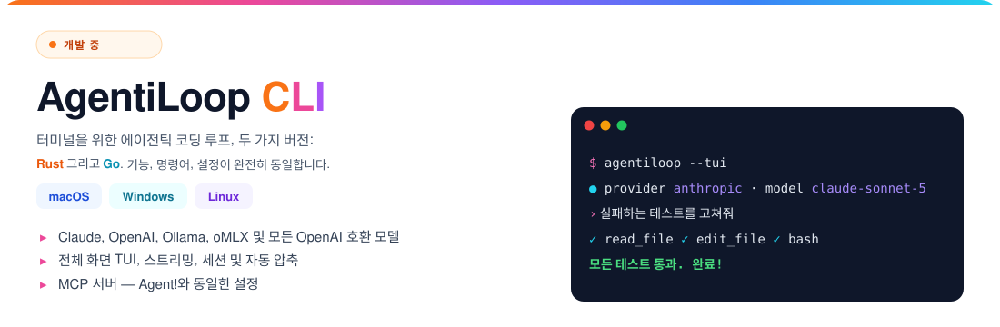

# 🦾 AgentiLoop Agent!

### **스폰서 Fluxion AI의 메시지**

<a href="https://fluxionai.world/register?source=github&campaign=aiagent&promo=AIAGENT"></a>

[](https://github.com/AgentiLoop/Agent/releases/latest)
[](https://github.com/AgentiLoop/Agent/stargazers)
[](https://github.com/AgentiLoop/Agent/fork)
[](https://github.com/apple)
[](https://www.swift.org)
<a href="https://github.com/sponsors/AgentiLoop"></a>


*Agent!가 손쉬운 사용으로 Photo Booth를 조작 — 클릭도, 스크립트도 없이 그저 "사진 찍어줘".*

## 🆕 새로운 강자 등장: AgentiLoop CLI ⚡️

**에이전틱 루프, 이제 당신의 터미널에서 해방됩니다. Mac. Windows. Linux. 선택은 당신의 몫.**

Agent! 패밀리의 최신 멤버를 만나보세요: **완전히 동일한 기능**을 갖춘 두 개의 크로스 플랫폼 CLI. 취향대로 고르세요:

<a href="https://github.com/AgentiLoop/AgentiLoopCLI"></a>

*AgentiLoop Agent! for Mac으로 제작. 네, 에이전트가 직접 자기 동생들을 만들었습니다.* 🤖✨ 지금 바로 프리릴리스를 사용해 보세요!

<a href="https://github.com/AgentiLoop/AgentiLoopCLI"></a>
<a href="https://github.com/AgentiLoop/AgentiLoopGo"></a>

## README 번역

[English](README.md) · [Español](README_es.md) · [Français](README_fr.md) · [Deutsch](README_de.md) · [中文 (简体)](README_zh.md) · [Русский](README_ru.md) · [한국어](README_ko.md) · [日本語](README_ja.md)

## Agent 안의 체스


## Agent!란?

**하나의 앱. 어떤 AI든. Mac에 대한 완전한 통제.**

Agent!는 100% 네이티브 Swift 6.2 / SwiftUI 앱으로, **21개 LLM 제공자** — Claude, Codex, OpenAI, Gemini, Grok, Mistral, Mistral Vibe, DeepSeek, Hugging Face, Z.ai, BigModel, Alibaba DashScope, Qwen, Qwen Code, MiniMax, OpenRouter, Requesty, A2Agent, OrcaRouter, Ollama(클라우드 및 로컬), vLLM, LM Studio — 에 온디바이스 **Apple Intelligence**까지 더해, 실제로 *일을 해내는* 자율 작업 루프로 연결합니다: 코드베이스를 읽고, 버그를 고치고, Xcode 프로젝트를 빌드하고, diff를 커밋하고, 손쉬운 사용 API로 모든 Mac 앱을 조작하고, 사용자 또는 root 권한으로 셸 명령을 실행하고, iMessage로 결과를 보내고, 음성 *"Agent!"* 호출에 응답합니다.

NPM도, Electron도, 구독도, 텔레메트리도 없습니다. 직접 API 키를 가져오거나, 완전히 로컬로 실행하거나, Apple Intelligence로 무료로 실행하세요. 의존하는 모든 Swift 패키지는 같은 저자가 작성했습니다. 아래 [비하인드 스토리](#비하인드-스토리)를 참고하세요.

## 새로운 소식 🚀

**v1.1.x — The Hardened Harness Release** · [릴리스 →](https://github.com/AgentiLoop/Agent/releases/latest)

- **컨텍스트 압축, 재구축.** 임계값 = 모델 윈도우 − 예약 출력 − 버퍼, 실제 `input_tokens` 기반. 제공자 측 9섹션 LLM 요약이 온디바이스 4K 요약을 대체; 열린 목표, 계획 체크리스트, 편집된 파일은 매 압축 후 다시 첨부됩니다. 과도하게 큰 도구 결과는 발생 시 디스크로 넘기고 `restore_tool_result`로 복구할 수 있습니다. 413 오버플로는 강제 압축과 더 짧은 재시도로 처리; `max_tokens` 초과는 확대 후 계속하는 방식으로 복구됩니다.
- **편집 전 읽기 게이트.** `edit_file` / `apply_diff` / `diff_apply`는 이 작업에서 LLM이 읽지 않았거나 마지막 읽기 이후 디스크에서 변경된(SHA-256) 파일은 건드리지 않습니다. 거부 시 파일을 자동으로 읽어 다음 호출이 바로 편집이 되게 합니다. 외부 파일 변경은 매 턴 diff 스니펫으로 표시됩니다.
- **로컬 모델의 실제 컨텍스트 윈도우.** LM Studio, Ollama, vLLM이 모델별 실제 컨텍스트 길이를 보고합니다 — 더 이상 하드코딩된 32K 가정이 없습니다.
- **더 빠른 턴.** 읽기 전용 도구는 Claude 응답이 스트리밍되는 동안 시작; 입력 인식 셸 동시성; 429/529에 `Retry-After`를 반영한 지터 지수 재시도; 모든 제공자에서 스트림 중 SSE 오류 표시.
- **심층 방어.** `ShellSafetyService`가 이제 클라이언트 측뿐 아니라 데몬 측(AgentHelper + AgentUser)에서도 적용; 릴리스 빌드는 팀 없는 XPC 클라이언트를 거부; 두 XPC 리스너 모두 앱 자체 서명에서 파생된 동일 팀 코드 서명을 요구합니다.
- **활동 로그.** 더 이상 50K 잘림이나 500K 재시작 트림이 없습니다 — 큰 로그는 "Processing tab data…" 오버레이와 함께 메인 스레드 밖에서 렌더링; 선택적 "Activity Log Below HUD" 레이아웃.
- **앱 메뉴:** 업데이트 확인…(GitHub 릴리스), 웹사이트, GitHub. 모든 PR에 CI Build & Test 워크플로; **273개 테스트 통과**.
- 추가: 증거로 검증되는 기준을 가진 `goal_state`, 완료 전 선택적 크리틱 diff 리뷰, 작업 범위 `rewind_task`, Claude 확장 사고, `reasoning_effort` 전달, 에이전트별 모델 오버라이드가 가능한 서브 에이전트(동시 3개, 읽기 전용 6개), 복구 힌트가 있는 타입 도구 오류, 이벤트 훅.

## 빠른 시작 (다운로드)

1. [Agent!](https://github.com/AgentiLoop/Agent/releases/latest)를 **다운로드**하여 응용 프로그램으로 드래그 — 또는 Homebrew로:
   ```sh
   brew update && brew install --cask agentiloop-agent
   ```
2. **Agent!를 열기** — 모든 것이 자동으로 설정됩니다
3. **AI 선택** — 설정 → 제공자 선택 → API 키 입력

> ✅ **소스에서 컴파일할 필요가 전혀 없습니다.** 모든 릴리스**와** 모든 프리릴리스에는 CI가 빌드하고 AgentiLoop Team ID로 **Apple이 서명, 공증(notarize), 스테이플(staple)한** 사전 컴파일 Mac 바이너리(`.dmg` + `.zip`)가 함께 제공됩니다. 공식 바이너리는 실제 Developer ID를 갖기 때문에 **Launch Agent와 Launch Daemon이 항상 등록되며 절대 "사라지지" 않습니다** — 그런 일은 ad-hoc 서명된 소스 빌드에서만 발생합니다(아래 옵션 B 참고). 헬퍼가 사라졌다면 [최신 릴리스 바이너리](https://github.com/AgentiLoop/Agent/releases/latest)를 설치하기만 하면 됩니다.

## 빠른 시작 (소스에서 빌드)

> Agent! 자체를 수정하고 싶을 때만 필요합니다. 그 외 모든 분은 위의 서명된 바이너리를 사용하세요.

```bash
git clone https://github.com/AgentiLoop/agent.git
cd Agent
```

**옵션 A — Xcode (Apple Developer 계정):** `Agent.xcodeproj`를 열고, Development Team을 설정하고, `Agent` 타겟을 Build & Run한 뒤, 프롬프트가 뜨면 헬퍼를 승인하세요.

**옵션 B — 개발자 계정 없음 (Xcode Command Line Tools만):**
```bash
./build.sh              # Debug
./build.sh Release      # Release
open "build/DerivedData/Build/Products/Debug/Agent!.app"
```

> ⚠️ 옵션 B 빌드는 ad-hoc 서명입니다. Launch Agent/Daemon 헬퍼는 등록되지 않지만(SMAppService에 Team ID 필요), LLM 루프, 모든 도구, 손쉬운 사용, AppleScript, 셸, MCP는 여전히 동작합니다. **개발자 계정 없이 헬퍼를 원하시나요? 서명·공증된 릴리스 바이너리를 사용하세요 — 컴파일이 필요 없습니다.**

> 💡 **저렴한 설정:** **Z.ai**의 **GLM-5.3**(가장 빠른 가입, 기본 모델)은 백만 토큰당 몇 센트입니다. 로컬 실행? **GLM-4.7-Turbo**(32B)만 소비자용 하드웨어(Ollama 기준 64–128GB Apple Silicon)에 맞습니다.

### 문제 해결 (소스에서 빌드)

- **`xcode-select`가 Command Line Tools를 가리킴** → `sudo xcode-select -s /Applications/Xcode.app/Contents/Developer`
- **pull 후 이상한 `BUILD FAILED`** → 오래된 DerivedData: `./build.sh clean && ./build.sh`
- **헬퍼가 등록되지 않음** → 옵션 B에서는 정상; 옵션 A를 사용하거나 [서명된 릴리스 바이너리](https://github.com/AgentiLoop/Agent/releases/latest)를 설치하세요 — 모든 릴리스와 프리릴리스에 포함됩니다
- **Deployment target / SDK 오류** → Agent!는 macOS 26을 대상으로 합니다; macOS와 Xcode를 업데이트하세요
- **구성 인수는 대소문자 구분** → `./build.sh`(Debug) 또는 `./build.sh Release`

## 무엇을 할 수 있나요?

> *"Xcode 프로젝트를 빌드하고 오류를 모두 고쳐줘"* · *"음악 앱에서 내 Workout 플레이리스트 재생해줘"* · *"Photo Booth로 사진 찍어줘"* · *"엄마한테 6시에 집에 간다고 iMessage 보내줘"* · *"Safari 열고 도쿄행 항공편 검색해줘"* · *"이 클래스를 더 작은 파일로 리팩터링해줘"* · *"오늘 캘린더 일정이 뭐야?"*

원하는 것을 그냥 입력하세요. Agent!가 방법을 찾아 실행합니다.

---

## 주요 기능

- **🧠 자체 검증 작업 루프** — 추론하고, 실행하고, 결과를 관찰하고, 스스로 수정합니다. `goal_state` 기준이 증거와 함께 표시되기 전에는 작업이 완료를 선언할 수 없으며, 선택적 크리틱이 먼저 diff를 검토합니다.
- **🛠 에이전틱 코딩** — 코드베이스를 읽고, 문자열 치환 diff로 편집하고, Xcode 프로젝트를 네이티브로 빌드(클릭 가능한 오류)하고, git을 관리하고, 저장소를 이식 가능한 JSONL 리포 맵으로 색인합니다. 모든 편집은 스냅샷됩니다 — 원클릭 롤백 또는 작업 전체 `rewind_task`.
- **🖥 데스크톱 자동화** — 손쉬운 사용 API([AXorcist](https://github.com/steipete/AXorcist))로 모든 Mac 앱을 조작, 퍼지 자동 재시도가 있는 요소 기반. 여기에 NSAppleScript, JXA, 51개 ScriptingBridge 앱 브리지 — 모두 TCC와 함께 인프로세스.
- **📜 AgentScript** — 런타임에 컴파일되어 전체 TCC로 인프로세스 `dlopen`되는 Swift dylib. 삭제된 스크립트는 `.Trash`로 이동하며 복원 가능합니다.
- **🛡 권한 있는 실행** — Launch Agent로 사용자 권한 셸, 또는 딱 한 번 승인하는 Launch Daemon으로 root 셸(SMAppService + XPC). SMAppService가 이미 서명 아이덴티티를 강제하는 이유는 [docs/SECURITY.md](docs/SECURITY.md)를 참고하세요.
- **🎙 음성** — **"Agent!"**라고 말한 뒤 작업을 말하세요; 온디바이스 `SFSpeechRecognizer`, ~2.5초 무음 후 자동 실행, 반복.
- **📱 iMessage 원격 제어** — iPhone에서 `Agent! next song`을 문자로 보내세요; 승인된 발신자만. `chat.db`를 위해 전체 디스크 접근 권한이 필요합니다.
- **🌐 웹** — 내장 Safari 자동화(JavaScript + AppleScript); 크로스 브라우저를 위한 선택적 Selenium과 [Playwright MCP](https://github.com/microsoft/playwright-mcp).
- **🤝 서브 에이전트** — 메일박스 메시징과 에이전트별 모델 오버라이드가 있는 최대 3개 동시(읽기 전용 6개) 격리 에이전트.
- **🧩 MCP** — 설정 → MCP Servers에서 어떤 MCP 서버든 추가; 도구는 `mcp_<server>_<tool>`로 나타납니다. Xcode MCP: `{"mcpServers":{"xcode":{"command":"xcrun","args":["mcpbridge"],"transport":"stdio"}}}`.
- **🗂 탭, 기록, 메모리, 계획, 스킬** — 각 탭은 자체 프로젝트 폴더와 로그를 가짐; 영구 사용자 메모리; 모든 프롬프트에 표시되는 다중 계획 체크리스트.
- **🔄 폴백 체인** — 429/타임아웃/네트워크 실패 시 다음 구성된 제공자로 자동 전환.

## 후원

### 스폰서

<a href="https://fluxionai.world/register?source=github&campaign=aiagent&promo=AIAGENT"></a>

 **[Fluxion AI](https://fluxionai.world/register?source=github&campaign=aiagent&promo=AIAGENT)**: 하나의 통합 API로 GPT, Claude 및 기타 주요 AI 모델에 안정적이고 비용 효율적으로 접근할 수 있습니다. 공식 API 가격 대비 최대 70% 절약하고, [이 링크](https://fluxionai.world/register?source=github&campaign=aiagent&promo=AIAGENT)로 가입하면 $3의 API 크레딧을 받을 수 있습니다(프로모션 코드 `AIAGENT`).

프로젝트를 후원하고 싶은 기업 및 LLM 제공업체: [docs/SPONSORSHIP.md](./docs/SPONSORSHIP.md)(등급, 노출 위치)와 [docs/PROVIDER_PROGRAM.md](./docs/PROVIDER_PROGRAM.md)(LLM 제공업체 연동)를 참고하거나 [GitHub Sponsors](https://github.com/sponsors/AgentiLoop)로 직접 후원해 주세요. 모든 결제는 GitHub Sponsors를 통해 이루어집니다.

## 🤖 21개 AI 제공자

| 제공자 | 비용 | 최적 용도 |
|---|---|---|
| **A2Agent** | 저렴 | 공식 가격의 일부로 하나의 OpenAI 호환 키를 통해 DeepSeek, GLM, Kimi, MiniMax, Qwen |
| **Apple Intelligence** | 무료, 온디바이스 | 분류, 요약, 토큰 압축(두뇌 아이콘, 제공자 선택기에는 없음) |
| **Claude** | 토큰당(API 키) 또는 구독(OAuth) | 긴 자율 작업, 확장 사고, 프롬프트 캐싱 |
| **Codex** | ChatGPT 구독 | ChatGPT OAuth를 통한 OpenAI 모델 — API 키 없음, 토큰당 요금 없음 |
| **DeepSeek** | 저렴 | 저예산 코딩, 캐시 히트 보고 |
| **Google Gemini** | 유료(무료 티어 있음) | 긴 컨텍스트, 비전 |
| **Grok** (xAI) | 유료 | 실시간 정보 |
| **Hugging Face** | 다양 | 오픈 모델, 서버리스 또는 전용 엔드포인트 |
| **로컬 Ollama** / **vLLM** / **LM Studio** | 무료 + 하드웨어 | 완전 오프라인; 모델별 실제 컨텍스트 윈도우 감지 |
| **MiniMax** | 저렴 | 1M 토큰 컨텍스트 |
| **Mistral** / **Mistral Vibe** | 유료 | 오픈 웨이트 클라우드, 코드, 에이전트 제품 |
| **Ollama** (클라우드) | 무료 티어 | 호스팅된 오픈 모델 |
| **OpenAI** | 유료 | 범용, 도구 호출, 비전, `reasoning_effort` |
| **OpenRouter** | 유료 | 200개 이상 모델, 하나의 키; Claude는 Anthropic 프로토콜로 라우팅 |
| **OrcaRouter** | 유료 | 하나의 OpenAI 호환 키로 제공자 원가에 190개 이상 모델; auto/fusion/fallback 라우팅 |
| **Alibaba DashScope** (Model Studio / QwenCloud 종량제) | 저렴 | DashScope를 통한 Qwen 3.8; Model Studio `sk-` 및 QwenCloud `sk-ws-` 키 |
| **Qwen** (qwen.ai Token Plan) | 구독 | QwenCloud Token Plan(`sk-sp-` 키, `token-plan.*.maas.aliyuncs.com`): qwen3.8-max, qwen3.7-plus, GLM-5.2, DeepSeek V4 |
| **Qwen Code** | 구독 | Alibaba Coding Plan(`sk-sp-` 키): qwen3-coder-plus, qwen3.7-plus, GLM-5, Kimi K2.5, MiniMax-M2.5 |
| **Requesty** | 유료 | 하나의 OpenAI 호환 키로 300개 이상 모델; 모델별 가격 및 기능 메타데이터 |
| **Z.ai** / **BigModel** | 저렴 | GLM-5.3 — 추천 시작점 |

> 💡 자체 호스팅 제공자는 API 요금 측면에서만 무료입니다 — 쓸 만한 30B+ 모델에는 M2/M3/M4 Ultra Mac Studio(64–128GB)가 필요합니다. 그런 하드웨어가 없다면 위의 저렴한 클라우드 경로가 훨씬 더 저렴합니다.

## 도구

정식 이름은 `AgentTools.Name.*`에서 옵니다(원본: [AgentTools](https://github.com/AgentiLoop/AgentTools) 패키지). 제공자별 토글로 개별 도구를 숨길 수 있습니다.

| 그룹 | 도구 |
|---|---|
| **Core** | `done` · `list_tools` · `search` · `web_search` · `fetch` · `chat` · `memory` · `plan` · `goal_state` · `restore_tool_result` · `directory` · `skill` · `ask_user` · `index` |
| **코드 / 빌드** | `file` (read/write/edit/diff_apply/undo/list/search/mkdir/…) · `git` · `xcode` (build/run/analyze/snippet/code_review/add_file/bump_version/…) · `agent_script` |
| **셸** | `user_shell` (Launch Agent) · `root_shell` (Launch Daemon) · `shell` (인프로세스 폴백) · `batch` · `multi` |
| **macOS 자동화** | `accessibility` (25개 요소 기반 액션) · `applescript` (`lookup_sdef` 포함) · `javascript` (JXA) |
| **웹** | `safari` · `selenium` · `mcp_playwright_browser_*` (선택) |
| **서브 에이전트** | `spawn_agent` · `tell_agent` |

액션별 전체 참조: [docs/TECHNICAL.md](docs/TECHNICAL.md).

## AgentScript — 전체 TCC를 가진 Swift 스크립트

AgentScript는 `~/Documents/AgentScript/agents/Sources/Scripts/`에 있는 평범한 Swift 파일입니다. Agent!는 각각을 SwiftPM으로 `.dylib`로 컴파일한 뒤(`Package.swift`는 모든 스크립트와 51개 ScriptingBridge 앱 브리지를 나열), Agent! 자체의 TCC 권한 — 손쉬운 사용, 자동화, 캘린더, 연락처, Mail, 사진 등 — 으로 `dlopen`합니다. LLM은 `agent_script`(`create` / `edit` / `run` / `delete` / `restore` / `pull`)로 관리하며, 폴더에 ~35개 예제가 포함됩니다(`Hello`, `TodayEvents`, `NowPlaying`, `CheckMail`, `CreateDmg`, `ArchiveXcode`, …).

**진입점** — 최상위 코드 없음, `exit()` 없음; `stdout`은 LLM에 반환되고, 반환값은 종료 상태입니다:

```swift
import Foundation
import CalendarBridge   // 어떤 `import XBridge`든 자동 연결 — Package.swift 편집 불필요

@_cdecl("script_main")
public func scriptMain() -> Int32 {
    print("Hello from AgentScript! 👋")
    return 0
}
```

**환경 변수 — 어떻게 설정되는가.** LLM은 환경을 직접 건드리지 않습니다. 도구를 호출하면 Agent!의 `ScriptService`가 변수를 스크립트 프로세스로 내보냅니다(`ScriptService+Execution.swift`의 `env["AGENT_PROJECT_FOLDER"] = cwd`, `env["AGENT_SCRIPT_ARGS"] = arguments`; 인프로세스 변형은 `setenv(...)`). 같은 두 변수가 모든 `user_shell` / `root_shell` / `shell` 명령에도 내보내집니다.

```text
LLM 도구 호출                                          Agent!가 스크립트에 내보내는 것
─────────────────────────────────────────────────────  ─────────────────────────────────────────────
agent_script(action:"run", name:"TodayEvents")         AGENT_PROJECT_FOLDER=/Users/you/Documents/GitHub/Agent
                                                       (AGENT_SCRIPT_ARGS는 설정되지 않음)

agent_script(action:"run", name:"TodayEvents",         AGENT_PROJECT_FOLDER=/Users/you/Documents/GitHub/Agent
             arguments:"days=3,location=false,json=true")   AGENT_SCRIPT_ARGS="days=3,location=false,json=true"
```

| 변수 | 설정 시점 | 의미 |
|---|---|---|
| `AGENT_PROJECT_FOLDER` | 항상 | 활성 탭의 프로젝트 폴더(없으면 `$HOME`). 러너의 cwd도 여기로 설정됩니다. |
| `AGENT_SCRIPT_ARGS` | LLM이 `arguments:"…"`를 전달할 때만 | LLM이 전달한 문자열 그대로. 번들 예제는 `key=value,key=value` 규칙을 사용합니다. |

**환경 변수 — 어떻게 읽는가.** 스크립트 안에서 둘 다 `ProcessInfo.processInfo.environment`에서 옵니다. `Hello.swift` / `TodayEvents.swift`가 사용하는 정확한 파싱 패턴입니다:

```swift
import Foundation

@_cdecl("script_main")
public func scriptMain() -> Int32 {
    let env = ProcessInfo.processInfo.environment

    // 1. 프로젝트 폴더 — 항상 존재; 만약을 위해 cwd로 폴백
    let folder = env["AGENT_PROJECT_FOLDER"] ?? FileManager.default.currentDirectoryPath

    // 2. 인수 — LLM이 `arguments:"…"`를 전달하지 않으면 없음
    let argsString = env["AGENT_SCRIPT_ARGS"] ?? ""

    // 3. 기본값, 그다음 "key=value,key=value" 파싱
    var daysAhead    = 0
    var showLocation = true
    var outputJSON   = false

    for pair in argsString.split(separator: ",") {
        let parts = pair.split(separator: "=", maxSplits: 1).map { $0.trimmingCharacters(in: .whitespaces) }
        guard parts.count == 2 else { continue }
        switch parts[0] {
        case "days":     daysAhead    = Int(parts[1]) ?? 0
        case "location": showLocation = parts[1].lowercased() == "true"
        case "json":     outputJSON   = parts[1].lowercased() == "true"
        default: break
        }
    }

    print("Project folder: \(folder)")
    print("days=\(daysAhead) location=\(showLocation) json=\(outputJSON)")
    return 0
}
```

두 변수는 독립적입니다 — 절대 `AGENT_SCRIPT_ARGS`에서 프로젝트 폴더를 파싱하지 마세요. `user_shell` 안의 Bash 등가: `ls "$AGENT_PROJECT_FOLDER/Sources"`(cwd가 이미 거기이므로 `cd` 불필요).

**번들 스크립트의 실제 `AGENT_SCRIPT_ARGS` 규칙**(`~/Documents/AgentScript/agents/Sources/Scripts/`):

| 스크립트 | LLM이 전달하는 `arguments:` | 스타일 |
|---|---|---|
| `TodayEvents` | `days=3,location=false,json=true` | `key=value,…` |
| `CheckMail` | `unreadOnly=true,inboxCount=true,json=true` | `key=value,…` |
| `ListReminders` | `completed=false,limit=5` | `key=value,…` |
| `QuitApps` | `excluded=Xcode,Agent,Terminal` | 목록이 있는 `key=value` |
| `NowPlaying` | `json=true,artwork=true` | `key=value,…` |
| `ArchiveXcode` | `/path/to/Project.xcodeproj MyScheme 469UCUB275` | 위치 기반, 공백 구분(scheme/teamID 생략 시 자동 감지) |
| `CreateDmg` | `--app /path/to/App.app --output /path/out.dmg --name "My App" --compress` | 플래그 스타일, 공백 구분, 따옴표 존중 |

**JSON 입력 / 출력 — 환경 변수와 별개의 메커니즘.** 환경 변수는 Agent!가 프로세스로 내보내고, JSON 파일은 *스크립트 자체*가 `FileManager` / `JSONSerialization`으로 읽고 쓰는 디스크의 평범한 파일입니다. Agent!는 이를 만들거나, 전달하거나, 파싱하지 않습니다. 번들 스크립트의 두 가지 실제 패턴:

*1. JSON 전용 입력(`SendMessage`)* — env 인수 전혀 없음; 스크립트는 `SendMessage_input.json`을 요구하고 없으면 `1`을 반환:

```json
// ~/Documents/AgentScript/json/SendMessage_input.json   (실행 전 LLM이 file(action:"write")로 작성)
{ "recipient": "Mom", "message": "Home at 6", "imagePath": "~/Pictures/Photos Library.photoslibrary/originals/A/IMG_0001.jpeg" }

// ~/Documents/AgentScript/json/SendMessage_output.json  (스크립트가 작성)
{ "success": true, "timestamp": "2026-09-03T21:14:02Z", "recipient": "Mom", "message": "Home at 6" }
// 실패 시: { "success": false, "timestamp": "…", "error": "Missing required field: recipient" }
```

```swift
// SendMessage.swift — 스크립트가 읽는 방법
let inputPath  = "\(NSHomeDirectory())/Documents/AgentScript/json/SendMessage_input.json"
guard let inputData = FileManager.default.contents(atPath: inputPath) else {
    writeOutput(outputPath, success: false, error: "Input file not found: \(inputPath)"); return 1
}
guard let json = try? JSONSerialization.jsonObject(with: inputData) as? [String: Any],
      let recipientHandle = json["recipient"] as? String else { /* … */ return 1 }
let message   = json["message"]   as? String
let imagePath = json["imagePath"] as? String
```

*2. 옵션은 env 인수, 구조화된 출력은 JSON(`TodayEvents`, `NowPlaying`, `CheckMail`, `ListReminders`)* — 옵션은 `AGENT_SCRIPT_ARGS`(또는 선택적 `<Name>_input.json`)에서 오며, `json=true`이면 스크립트는 LLM에 돌아가는 사람이 읽을 수 있는 stdout에 더해 `<Name>_output.json`을 작성합니다:

```json
// agent_script(action:"run", name:"TodayEvents", arguments:"days=3,json=true")
// → ~/Documents/AgentScript/json/TodayEvents_output.json
{ "success": true, "timestamp": "…", "count": 2,
  "events": [ { "summary": "Standup", "calendar": "Work", "startTime": "…", "endTime": "…", "allDay": false, "location": "…" }, … ] }

// agent_script(action:"run", name:"NowPlaying", arguments:"json=true,artwork=true")
// → ~/Documents/AgentScript/json/NowPlaying_output.json
{ "success": true, "playerState": "playing",
  "track": { "name": "…", "artist": "…", "album": "…", "duration": 240 },
  "artwork": { "saved": true, "path": "~/Documents/AgentScript/images/….png", "width": 500, "height": 500 } }
```

```swift
// TodayEvents.swift — 스크립트가 쓰는 방법
func writeTodayEventsOutput(_ path: String, success: Bool, error: String? = nil,
                            events: [[String: Any]]? = nil, count: Int? = nil, outputJSON: Bool) {
    guard outputJSON else { return }
    var result: [String: Any] = ["success": success, "timestamp": ISO8601DateFormatter().string(from: Date())]
    if !success, let error { result["error"] = error }
    if success { if let events { result["events"] = events }; if let count { result["count"] = count } }
    try? FileManager.default.createDirectory(atPath: (path as NSString).deletingLastPathComponent, withIntermediateDirectories: true)
    if let out = try? JSONSerialization.data(withJSONObject: result, options: .prettyPrinted) {
        try? out.write(to: URL(fileURLWithPath: path))
    }
}
```

삭제된 스크립트는 `~/Documents/AgentScript/agents/.Trash/`로 이동합니다(`agent_script(action:"restore")`); `action:"pull"`은 [AgentScripts](https://github.com/AgentiLoop/AgentScripts) 저장소에서 업스트림 버전을 가져옵니다.

## 🔒 Jev — 셸 명령 전 두 번째 의견

**Jev**(TypeSafe System One)는 Agent!가 셸 명령을 실행하기 *전에* 검토하는 선택적 의사결정 계층입니다. 선택한 LLM 제공자를 보완할 뿐, 절대 대체하지 않습니다.

- **하는 일.** 하드코딩된 `ShellSafetyService` 규칙을 이미 통과한 모든 명령이 Jev로 전송되며, Jev는 데이터를 비가역적으로 파괴할 가능성을 평가합니다. 임계값 이상이면 평가와 명령 텍스트와 함께 거부되고, 미만이면 실행됩니다.
- **적용 범위.** 모든 셸 경로: 인프로세스 셸, 사용자 Launch Agent(`user_shell`), 권한 있는 Launch Daemon(`root_shell`).
- **조정 가능한 컷오프.** 설정 → LLM Common Settings → **Reject at … % destructive**, 0–100%를 10% 단위로. 기본값 **70%**.
- **설계상 fail-open.** API 키 없음, **Consult Jev before tools** 토글 꺼짐, 또는 TypeSafe 장애는 "의견 없음"을 뜻합니다 — 명령은 진행되고 실패는 로그에 남으며, 절대 조용히 안전 판정으로 취급되지 않습니다. Jev 검사 중 작업을 취소하면 명령이 중지됩니다.
- **가시성.** 모든 검사는 파괴 위험 백분율, 허용/거부 판정, 응답 모델, 입력/출력 토큰 수를 기록합니다.
- **구성.** API 키(키체인 저장), 카탈로그 새로고침이 있는 모델 선택기, 어드바이저 토글 모두 LLM Common Settings에 있습니다. 클라이언트는 번들된 `TypeSafeKit` / `TypeSafeMiddleware` Swift 패키지에 있습니다.

## 개인정보 보호 및 안전

파일, 화면 내용, 개인 데이터는 절대 Mac을 떠나지 않습니다 — 클라우드 제공자는 프롬프트 텍스트만 보고, 로컬 제공자는 모든 것을 오프라인으로 유지합니다. 모든 액션은 로그에 기록됩니다.

| 계층 | 하는 일 |
|---|---|
| **Shell Safety Service** | `rm -rf /`, `rm -rf ~`, 베어 글롭 `rm -rf`, `--no-preserve-root`를 하드 차단 — 클라이언트 측 **및** 데몬 측에서 적용. LLM이 우회할 수 없음. |
| **XPC 클라이언트 신뢰** | 두 리스너 모두 앱 자체 서명에서 파생된 동일 팀 코드 서명을 요구; 릴리스 빌드는 팀 없는 클라이언트를 거부. |
| **편집 전 읽기 게이트** | 읽지 않았거나 외부에서 수정된 파일의 편집은 거부(SHA-256), 거부 시 자동 읽기. |
| **파일 백업 + 되감기** | 모든 편집 스냅샷(1주 TTL); 롤백 UI, `file(action:"undo")`, 또는 작업 범위 `rewind_task`. |
| **TCC 인프로세스 라우팅** | AppleScript/JXA/screencapture/손쉬운 사용 명령은 Agent!가 TCC 권한을 가진 인프로세스에서 실행되며, 절대 데몬을 거치지 않음. |
| **도구 실행 게이팅** | LLM은 결과를 지어낼 수 없음 — 모든 호출은 `dispatchTool()`을 거쳐 실제 출력을 반환. 도구 없는 "클릭/검색했어요…" 주장은 정정이 주입됨. |
| **타입 오류 + 가드** | 모든 실패 도구 결과는 복구 힌트를 포함; 반복/정체 가드가 넛지한 뒤 중지; 완료 게이트는 작업당 거부를 3회로 제한. |
| **Console 감사 추적** | 모든 도구 호출과 모든 헬퍼 명령이 로그에 기록됨. |

## 키보드 단축키 및 슬래시 명령

| 단축키 | 동작 |
|---|---|
| `Return` | 작업 실행 · `⌘ .` / `Esc` 취소 |
| `⌘ T` / `⌘ W` / `⌘ 1–9` / `⌘ ⇧ ←→` | 새 탭 / 닫기 / 전환 / 이전-다음 탭 |
| `⌘ B` / `⌘ D` | LLM Output 오버레이 / 셰브론 토글 |
| `⌘ F` / `⌘ L` / `⌘ V` | 로그 검색 / 로그 지우기 / 이미지 붙여넣기 |
| `↑` / `↓` | 프롬프트 기록 |
| `⌘ ⇧ M` / `⌘ ⇧ P` | 메시지 모니터 / 설정 |
| `⌘ ⇧ K` `L` `H` `J` `U` | 모두 지우기 / LLM 패널 / 프롬프트 기록 / 작업 기록 / 토큰 카운터 |

슬래시 명령은 로컬에서 실행됩니다: `/clear [log|all|llm|history|tasks|tokens]`, `/memory [show|clear|edit|<text>]`.

## FAQ

**코딩을 알아야 하나요?** 아니요 — 평범한 한국어(또는 모국어)면 됩니다.
**비용은 얼마인가요?** 앱은 비상업적·개인 용도로 무료입니다(PolyForm Noncommercial 1.0.0). 제공자 비용만 지불하면 됩니다; 진지한 작업에는 Z.ai/BigModel의 GLM-5.3이나 DeepSeek이 가장 저렴합니다. 하드웨어가 있다면 로컬 모델은 무료입니다.
**어떤 Mac이 필요한가요?** Apple Silicon, macOS 26.4.1+. 클라우드 제공자는 최신 Mac이면 충분; 30B 로컬 모델은 64GB+.
**Siri와 어떻게 다른가요?** Siri는 답합니다. Agent!는 *행동합니다* — 앱, 파일, 코드, 시스템.

더 보기: [docs/FAQ.md](docs/FAQ.md) · [기술 아키텍처](docs/TECHNICAL.md) · [비교](docs/COMPARISON.md) (Claude Code, Cursor, Cline, OpenClaw 대비) · [보안 모델](docs/SECURITY.md)

## 비하인드 스토리

Agent!는 3년간 에이전틱 AI 앱을 만든 결과입니다 — ANIE, Game Changer, BattleScript, XCF MCP Server와 Client, D1F, 그리고 약 8개의 독창적인 Swift 패키지. 빠진 조각은 지능적인 자율 루프였고, 이를 달성하자 그 프로젝트들의 정수가 Agent!로 모였습니다. 비디오 게임([Boss-Man](https://github.com/AgentiLoop/bossman))을 작성하고, 앱을 만들고, AppleScript로 Pages에 시를 쓰고, 디스크 이미지를 생성해 GitHub 릴리스에 첨부했습니다. Claude Code가 ~65개의 서드파티 NPM 패키지에 의존하는 반면, Agent!는 100% 네이티브이고, RAM을 거의 사용하지 않으며, Xcode 자동화, Swift Syntax 6.2 분석, 손쉬운 사용, AppleScript, AgentScript/ScriptingBridge, Safari 자동화, MCP 지원을 기본으로 제공합니다.

## 기여하기

[CONTRIBUTING.md](./CONTRIBUTING.md)를 참고하세요 — `./build.sh`로 ~5분 만에 소스에서 빌드, 개발자 계정 불필요. Pull request는 CI Build & Test 워크플로를 실행합니다. [good first issues](https://github.com/AgentiLoop/Agent/issues?q=is%3Aissue+is%3Aopen+label%3A%22good+first+issue%22)를 확인하세요.

## 라이선스

[PolyForm Noncommercial 1.0.0](./LICENSE) — 비상업적·개인 용도로 무료. 상업적 사용 및 소프트웨어의 상업용 버전은 Logos InkPen LLC 회사인 AgentiLoop.ai에 독점적으로 유보됩니다. 상업용 라이선스는 AgentiLoop에 문의하세요.

---

> ⚠️ **법적 고지 및 저작자 표시**
>
> ### 상표 고지
>
> "AgentiLoop Agent! for Mac"은 독립적인 소프트웨어 프로젝트이며 Apple Inc.와 제휴, 보증, 후원 또는 기타 관련이 **없습니다**. "Apple", "Mac", "Mac mini", "MacBook", "macOS" 및 관련 마크는 미국 및 기타 국가에 등록된 Apple Inc.의 상표입니다. 여기에 언급된 기타 모든 상표, 서비스 마크 및 상호는 각 소유자의 재산이며 식별 목적으로만 사용됩니다.
>
> "AgentiLoop Agent!"와 AgentiLoop Agent! 로고는 Logos InkPen LLC 회사인 AgentiLoop.ai의 상표입니다. 이 마크의 사용에는 사전 서면 허가가 필요합니다. 아래 PolyForm Noncommercial 라이선스는 소스 코드에 대한 권리만 부여하며 — 상표권은 **부여하지 않습니다**.
>
> ### 소스 코드 라이선스 (PolyForm Noncommercial 1.0.0)
>
> "AgentiLoop Agent! for Mac"의 소스 코드는 공개되어 있으며 **PolyForm Noncommercial License 1.0.0**으로 제공됩니다. [LICENSE](./LICENSE) 파일의 조건(Required Notice와 라이선스 조항의 사본 또는 링크 유지)에 따라 모든 비상업적 목적으로 소스 코드를 자유롭게 사용, 복사, 수정, 배포할 수 있습니다. 상업적 사용 및 소프트웨어의 상업용 버전은 Logos InkPen LLC 회사인 AgentiLoop.ai에 독점적으로 유보됩니다.
>
> ### 컴파일된 바이너리 및 릴리스
>
> 이 프로젝트의 GitHub Releases, [AgentiLoop.ai](https://AgentiLoop.ai) 또는 기타 공식 채널을 통해 배포되는 컴파일된 바이너리, 설치 프로그램, 코드 서명된 빌드 및 릴리스 아티팩트는 Logos InkPen LLC 회사인 AgentiLoop.ai의 저작물이며 소스 코드를 규율하는 PolyForm Noncommercial 라이선스의 적용을 **받지 않습니다**. 공식 바이너리에 대한 모든 권리 — "AgentiLoop Agent!" 이름, 로고, 코드 서명 아이덴티티, Developer ID 포함 — 는 유보됩니다.
>
> Copyright © 2026 AgentiLoop.ai, a Logos InkPen LLC company. All rights reserved.
>
> "AgentiLoop Agent!" 이름, 로고 또는 브랜딩을 제품 식별에 사용하지 않는 한, PolyForm Noncommercial 라이선스에 따라 비상업적 용도로 소스에서 직접 바이너리를 빌드하는 것을 환영합니다.
>
> ### 보증 부인
>
> 이 소프트웨어는 상품성, 특정 목적 적합성 및 비침해에 대한 보증을 포함하되 이에 국한되지 않는 명시적 또는 묵시적 어떠한 보증 없이 **"있는 그대로"** 제공됩니다. 어떠한 경우에도 저자 또는 저작권자는 계약, 불법 행위 또는 기타 소송에서 소프트웨어 또는 소프트웨어의 사용이나 기타 거래로 인해 발생하는 청구, 손해 또는 기타 책임에 대해 책임지지 않습니다.
>
> ---
>
> AgentiLoop Agent!에 관심을 가져 주셔서 감사합니다 — 정품 Mac 하드웨어와 소프트웨어에서 macOS 26.4 이상을 실행하는 Mac mini, MacBook, Mac Studio 컴퓨터를 위해 제작된 애플리케이션입니다.
>
> - 웹사이트: https://AgentiLoop.ai
> - Github : https://github.com/AgentiLoop/agent

### **스폰서 Fluxion AI의 메시지**

<a href="https://fluxionai.world/register?source=github&campaign=aiagent&promo=AIAGENT"></a>
