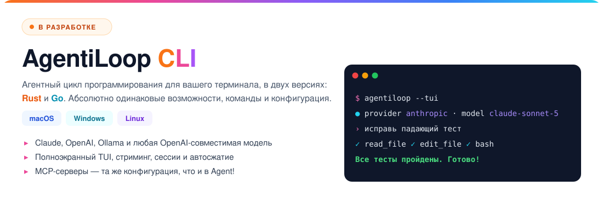

# 🦾 AgentiLoop Agent!

### **Сообщение от нашего спонсора Fluxion AI**

<a href="https://fluxionai.world/register?source=github&campaign=aiagent&promo=AIAGENT"></a>

[](https://github.com/AgentiLoop/Agent/releases/latest)
[](https://github.com/AgentiLoop/Agent/stargazers)
[](https://github.com/AgentiLoop/Agent/fork)
[](https://github.com/apple)
[](https://www.swift.org)
<a href="https://github.com/sponsors/AgentiLoop"></a>


*Agent! управляет Photo Booth через универсальный доступ — без кликов, без скриптов, просто «сделай фото».*

## 🆕 Новичок на районе: AgentiLoop CLI ⚡️

**Агентный цикл, выпущенный на свободу в вашем терминале. Mac. Windows. Linux. Выбор за вами.**

Знакомьтесь с новыми членами семьи Agent!: два кроссплатформенных CLI с **абсолютно одинаковыми возможностями**. Выбирайте свой вкус:

<a href="https://github.com/AgentiLoop/AgentiLoopCLI"></a>

*Создано с помощью AgentiLoop Agent! для Mac. Да, агент сам написал своих младших братьев.* 🤖✨ Попробуйте пре-релиз уже сегодня!

<a href="https://github.com/AgentiLoop/AgentiLoopCLI"></a>
<a href="https://github.com/AgentiLoop/AgentiLoopGo"></a>

## Переводы README

[English](README.md) · [Español](README_es.md) · [Français](README_fr.md) · [Deutsch](README_de.md) · [中文 (简体)](README_zh.md) · [Русский](README_ru.md) · [한국어](README_ko.md) · [日本語](README_ja.md)

## Шахматы внутри Agent


## Что такое Agent!?

**Одно приложение. Любой ИИ. Полный контроль над вашим Mac.**

Agent! — это 100 % нативное приложение на Swift 6.2 / SwiftUI, которое объединяет **21 LLM-провайдера** — Claude, Codex, OpenAI, Gemini, Grok, Mistral, Mistral Vibe, DeepSeek, Hugging Face, Z.ai, BigModel, Alibaba DashScope, Qwen, Qwen Code, MiniMax, OpenRouter, Requesty, A2Agent, OrcaRouter, Ollama (облако и локально), vLLM и LM Studio — плюс встроенный **Apple Intelligence** — в автономный цикл задач, который действительно *делает дела*: читает вашу кодовую базу, исправляет баг, собирает Xcode-проект, коммитит diff, управляет любым Mac-приложением через API универсального доступа, выполняет shell-команды от вашего имени или от root, отправляет результаты по iMessage и отзывается на произнесённое *«Agent!»*.

Никакого NPM, Electron, подписок и телеметрии. Используйте свой API-ключ, работайте полностью локально или бесплатно на Apple Intelligence. Каждый Swift-пакет, от которого зависит приложение, написан тем же автором. См. раздел [Предыстория](#предыстория) ниже.

## Что нового 🚀

**v1.1.x — The Hardened Harness Release** · [Релизы →](https://github.com/AgentiLoop/Agent/releases/latest)

- **Сжатие контекста, переписано с нуля.** Порог = окно модели − зарезервированный вывод − буфер, на основе реальных `input_tokens`. Серверное 9-секционное LLM-резюме заменяет 4K-резюме на устройстве; открытая цель, чек-лист плана и отредактированные файлы заново прикрепляются после каждого сжатия. Слишком большие результаты инструментов сбрасываются на диск при выдаче и восстанавливаются через `restore_tool_result`. Переполнение 413 проходит через принудительное сжатие с укороченным повтором; превышения `max_tokens` восстанавливаются эскалацией, затем продолжением.
- **Гейт «прочитай перед правкой».** `edit_file` / `apply_diff` / `diff_apply` отказываются трогать файл, который LLM не читал в этой задаче или который изменился на диске с последнего чтения (SHA-256). Отказ автоматически читает файл, так что следующий вызов — уже правка. Внешние изменения файлов показываются каждый ход в виде фрагментов diff.
- **Реальные контекстные окна для локальных моделей.** LM Studio, Ollama и vLLM сообщают фактическую длину контекста каждой модели — больше никаких жёстко заданных 32K.
- **Быстрее ходы.** Инструменты только для чтения запускаются, пока ответ Claude ещё стримится; shell-параллелизм с учётом ввода; экспоненциальный повтор с джиттером и `Retry-After` на 429/529; ошибки SSE посреди стрима выводятся у всех провайдеров.
- **Глубокая защита.** `ShellSafetyService` теперь применяется и на стороне демона (AgentHelper + AgentUser), и на стороне клиента; релизные сборки отклоняют XPC-клиентов без Team ID; оба XPC-слушателя требуют подписи кода той же команды, выведенной из подписи самого приложения.
- **Журнал активности.** Больше никакого обрезания на 50K или обрезки при перезапуске на 500K — большие журналы рендерятся вне главного потока с оверлеем «Processing tab data…»; опциональная раскладка «Activity Log Below HUD».
- **Меню приложения:** Проверить обновления… (релизы GitHub), Сайт, GitHub. CI-процесс Build & Test на каждый PR; **273 проходящих теста**.
- Плюс: `goal_state` с критериями, подтверждёнными доказательствами, опциональная проверка diff критиком перед завершением, `rewind_task` в рамках задачи, расширенное мышление для Claude, проброс `reasoning_effort`, суб-агенты с переопределением модели для каждого (3 параллельных, 6 только для чтения), типизированные ошибки инструментов с подсказками по восстановлению, хуки событий.

## Быстрый старт (Скачать)

1. **Скачайте** [Agent!](https://github.com/AgentiLoop/Agent/releases/latest) и перетащите в «Программы» — или через Homebrew:
   ```sh
   brew update && brew install --cask agentiloop-agent
   ```
2. **Откройте Agent!** — он настроит всё автоматически
3. **Выберите свой ИИ** — Настройки → выберите провайдера → введите API-ключ

> ✅ **Вам никогда не нужно компилировать из исходников.** Каждый релиз **и** каждый пре-релиз поставляется с предварительно скомпилированным Mac-бинарником (`.dmg` + `.zip`), собранным CI и **подписанным, нотаризованным и скреплённым (stapled) Apple** с Team ID AgentiLoop. Поскольку официальные бинарники несут настоящий Developer ID, **Launch Agent и Launch Daemon всегда регистрируются и никогда не «теряются»** — это происходит только со сборками из исходников с ad-hoc подписью (см. Вариант B ниже). Если ваши хелперы исчезли, просто установите [бинарник последнего релиза](https://github.com/AgentiLoop/Agent/releases/latest).

## Быстрый старт (Сборка из исходников)

> Нужно только если вы хотите дорабатывать сам Agent!. Всем остальным: используйте подписанный бинарник выше.

```bash
git clone https://github.com/AgentiLoop/agent.git
cd Agent
```

**Вариант A — Xcode (аккаунт Apple Developer):** откройте `Agent.xcodeproj`, укажите свою Development Team, выполните Build & Run для таргета `Agent`, одобрите хелпер при запросе.

**Вариант B — без аккаунта разработчика (только Xcode Command Line Tools):**
```bash
./build.sh              # Debug
./build.sh Release      # Release
open "build/DerivedData/Build/Products/Debug/Agent!.app"
```

> ⚠️ Сборки по Варианту B подписаны ad-hoc. Хелперы Launch Agent/Daemon не зарегистрируются (SMAppService требует Team ID), но LLM-цикл, все инструменты, универсальный доступ, AppleScript, shell и MCP по-прежнему работают. **Хотите хелперы без аккаунта разработчика? Используйте подписанный, нотаризованный релизный бинарник — компилировать не нужно.**

> 💡 **Дешёвая настройка:** **GLM-5.3** через **Z.ai** (самая быстрая регистрация, модель по умолчанию) стоит копейки за миллион токенов. Запускаете локально? Только **GLM-4.7-Turbo** (32B) помещается на потребительское железо (64–128 ГБ Apple Silicon через Ollama).

### Устранение неполадок (Сборка из исходников)

- **`xcode-select` указывает на Command Line Tools** → `sudo xcode-select -s /Applications/Xcode.app/Contents/Developer`
- **Странный `BUILD FAILED` после pull** → устаревший DerivedData: `./build.sh clean && ./build.sh`
- **Хелперы не регистрируются** → ожидаемо для Варианта B; используйте Вариант A или просто установите [подписанный релизный бинарник](https://github.com/AgentiLoop/Agent/releases/latest) — он есть в каждом релизе и пре-релизе
- **Ошибки deployment target / SDK** → Agent! нацелен на macOS 26; обновите macOS и Xcode
- **Аргумент конфигурации чувствителен к регистру** → `./build.sh` (Debug) или `./build.sh Release`

## Что он умеет?

> *«Собери Xcode-проект и исправь все ошибки»* · *«Включи мой плейлист Workout в Музыке»* · *«Сделай фото в Photo Booth»* · *«Отправь маме iMessage, что буду дома в 6»* · *«Открой Safari и найди билеты в Токио»* · *«Разбей этот класс на файлы поменьше»* · *«Какие у меня события в календаре сегодня?»*

Просто напишите, чего хотите. Agent! сам разберётся как и сделает это.

---

## Ключевые возможности

- **🧠 Самопроверяющийся цикл задач** — рассуждает, выполняет, наблюдает результаты, самокорректируется. Задача не может объявить себя завершённой, пока критерии `goal_state` не отмечены с доказательствами; опциональный критик сначала проверяет diff.
- **🛠 Агентное программирование** — читает кодовые базы, редактирует через diff с заменой строк, нативно собирает Xcode-проекты (кликабельные ошибки), управляет git, индексирует репозитории в переносимую JSONL-карту. Каждая правка снапшотится — откат в один клик или `rewind_task` для всей задачи.
- **🖥 Автоматизация рабочего стола** — управляет любым Mac-приложением через API универсального доступа ([AXorcist](https://github.com/steipete/AXorcist)), на основе элементов с нечётким авто-повтором. Плюс NSAppleScript, JXA и 51 мост ScriptingBridge — всё in-process с TCC.
- **📜 AgentScript** — Swift-dylib, компилируемые на лету и загружаемые через `dlopen` in-process с полным TCC. Удалённые скрипты попадают в `.Trash` и восстанавливаются.
- **🛡 Привилегированное выполнение** — shell от вашего имени через Launch Agent или от root через Launch Daemon, который вы одобряете ровно один раз (SMAppService + XPC). См. [docs/SECURITY.md](docs/SECURITY.md) о том, почему SMAppService уже проверяет подпись.
- **🎙 Голос** — скажите **«Agent!»** и задачу; `SFSpeechRecognizer` на устройстве, автозапуск после ~2,5 с тишины, работает циклически.
- **📱 Удалённое управление через iMessage** — напишите `Agent! next song` с iPhone; только одобренные отправители. Требует Full Disk Access для `chat.db`.
- **🌐 Веб** — встроенная автоматизация Safari (JavaScript + AppleScript); опционально Selenium и [Playwright MCP](https://github.com/microsoft/playwright-mcp) для кроссбраузерности.
- **🤝 Суб-агенты** — до 3 параллельных (6 только для чтения) изолированных агентов с почтовыми сообщениями и переопределением модели для каждого.
- **🧩 MCP** — добавьте любой MCP-сервер в Настройки → MCP Servers; инструменты появляются как `mcp_<server>_<tool>`. Xcode MCP: `{"mcpServers":{"xcode":{"command":"xcrun","args":["mcpbridge"],"transport":"stdio"}}}`.
- **🗂 Вкладки, история, память, планы, навыки** — у каждой вкладки своя папка проекта и журнал; постоянная память пользователя; чек-листы нескольких планов показываются в каждом промпте.
- **🔄 Цепочка резервирования** — автопереключение на следующего настроенного провайдера при 429/таймауте/сетевом сбое.

## Спонсорство

### Спонсоры

<a href="https://fluxionai.world/register?source=github&campaign=aiagent&promo=AIAGENT"></a>

 **[Fluxion AI](https://fluxionai.world/register?source=github&campaign=aiagent&promo=AIAGENT)**: надёжный и экономичный доступ к GPT, Claude и другим ведущим моделям ИИ через единый API. Экономьте до 70 % по сравнению с официальными ценами API и получите $3 в виде API-кредитов при регистрации по [этой ссылке](https://fluxionai.world/register?source=github&campaign=aiagent&promo=AIAGENT) (промокод `AIAGENT`).

Компаниям и LLM-провайдерам, которые хотят поддержать проект: см. [docs/SPONSORSHIP.md](./docs/SPONSORSHIP.md) (уровни, размещения) и [docs/PROVIDER_PROGRAM.md](./docs/PROVIDER_PROGRAM.md) (интеграция LLM-провайдеров) или станьте спонсором напрямую через [GitHub Sponsors](https://github.com/sponsors/AgentiLoop). Все платежи проходят через GitHub Sponsors.

## 🤖 21 LLM-провайдер

| Провайдер | Стоимость | Лучше всего для |
|---|---|---|
| **A2Agent** | Дёшево | DeepSeek, GLM, Kimi, MiniMax и Qwen через один OpenAI-совместимый ключ за долю официальной цены |
| **Apple Intelligence** | Бесплатно, на устройстве | Триаж, резюме, сжатие токенов (иконка мозга, нет в списке провайдеров) |
| **Claude** | За токены (API-ключ) или подписка (OAuth) | Длинные автономные задачи, расширенное мышление, кэширование промптов |
| **Codex** | Подписка ChatGPT | Модели OpenAI через ChatGPT OAuth — без API-ключа, без оплаты за токены |
| **DeepSeek** | Дёшево | Бюджетное программирование, отчёт о cache-hit |
| **Google Gemini** | Платно (есть бесплатный уровень) | Длинный контекст, зрение |
| **Grok** (xAI) | Платно | Информация в реальном времени |
| **Hugging Face** | По-разному | Открытые модели, serverless или выделенные эндпоинты |
| **Локальные Ollama** / **vLLM** / **LM Studio** | Бесплатно + железо | Полностью офлайн; определяется реальное контекстное окно каждой модели |
| **MiniMax** | Дёшево | Контекст 1M токенов |
| **Mistral** / **Mistral Vibe** | Платно | Open-weight облако, код, агентный продукт |
| **Ollama** (облако) | Бесплатный уровень | Хостинг открытых моделей |
| **OpenAI** | Платно | Общего назначения, вызов инструментов, зрение, `reasoning_effort` |
| **OpenRouter** | Платно | 200+ моделей, один ключ; Claude маршрутизируется через протокол Anthropic |
| **OrcaRouter** | Платно | 190+ моделей через один OpenAI-совместимый ключ по цене провайдера; маршрутизация auto/fusion/fallback |
| **Alibaba DashScope** | Дёшево | Qwen 3.8 через DashScope; ключи Model Studio `sk-` и QwenCloud `sk-ws-` |
| **Qwen** (qwen.ai Token Plan) | Подписка | QwenCloud Token Plan (ключ `sk-sp-`, `token-plan.*.maas.aliyuncs.com`): qwen3.8-max, qwen3.7-plus, GLM-5.2, DeepSeek V4 |
| **Qwen Code** | Подписка | Alibaba Coding Plan (ключ `sk-sp-`): qwen3-coder-plus, qwen3.7-plus, GLM-5, Kimi K2.5, MiniMax-M2.5 |
| **Requesty** | Платно | 300+ моделей через один OpenAI-совместимый ключ; цены и метаданные возможностей по каждой модели |
| **Z.ai** / **BigModel** | Дёшево | GLM-5.3 — рекомендуемая отправная точка |

> 💡 Самостоятельно размещённые провайдеры бесплатны только в смысле платы за API — для пригодной модели 30B+ нужен Mac Studio с M2/M3/M4 Ultra (64–128 ГБ). Без такого железа дешёвые облачные варианты выше значительно выгоднее.

## Инструменты

Канонические имена берутся из `AgentTools.Name.*` (источник истины: пакет [AgentTools](https://github.com/AgentiLoop/AgentTools)). Переключатели для каждого провайдера могут скрывать отдельные инструменты.

| Группа | Инструменты |
|---|---|
| **Core** | `done` · `list_tools` · `search` · `web_search` · `fetch` · `chat` · `memory` · `plan` · `goal_state` · `restore_tool_result` · `directory` · `skill` · `ask_user` · `index` |
| **Код / сборка** | `file` (read/write/edit/diff_apply/undo/list/search/mkdir/…) · `git` · `xcode` (build/run/analyze/snippet/code_review/add_file/bump_version/…) · `agent_script` |
| **Shell** | `user_shell` (Launch Agent) · `root_shell` (Launch Daemon) · `shell` (in-process запасной) · `batch` · `multi` |
| **Автоматизация macOS** | `accessibility` (25 действий на основе элементов) · `applescript` (с `lookup_sdef`) · `javascript` (JXA) |
| **Веб** | `safari` · `selenium` · `mcp_playwright_browser_*` (опционально) |
| **Суб-агенты** | `spawn_agent` · `tell_agent` |

Полный справочник по действиям: [docs/TECHNICAL.md](docs/TECHNICAL.md).

## AgentScript — Swift-скрипты с полным TCC

AgentScript — это обычные Swift-файлы в `~/Documents/AgentScript/agents/Sources/Scripts/`. Agent! компилирует каждый в `.dylib` через SwiftPM (`Package.swift` перечисляет все скрипты плюс 51 мост ScriptingBridge), затем загружает его через `dlopen` с собственными TCC-разрешениями Agent! — универсальный доступ, автоматизация, Календарь, Контакты, Почта, Фото и т. д. LLM управляет ими через `agent_script` (`create` / `edit` / `run` / `delete` / `restore` / `pull`); в папке поставляется ~35 примеров (`Hello`, `TodayEvents`, `NowPlaying`, `CheckMail`, `CreateDmg`, `ArchiveXcode`, …).

**Точка входа** — без кода верхнего уровня, без `exit()`; `stdout` возвращается LLM, возвращаемое значение — код выхода:

```swift
import Foundation
import CalendarBridge   // любой `import XBridge` подключается автоматически — правки Package.swift не нужны

@_cdecl("script_main")
public func scriptMain() -> Int32 {
    print("Hello from AgentScript! 👋")
    return 0
}
```

**Переменные окружения — как они УСТАНАВЛИВАЮТСЯ.** LLM никогда не трогает окружение сам. Он вызывает инструмент, а `ScriptService` Agent! экспортирует переменные в процесс скрипта (`env["AGENT_PROJECT_FOLDER"] = cwd`, `env["AGENT_SCRIPT_ARGS"] = arguments` в `ScriptService+Execution.swift`; `setenv(...)` для in-process варианта). Те же две переменные экспортируются в каждую команду `user_shell` / `root_shell` / `shell`.

```text
Вызов инструмента LLM                                  Что Agent! экспортирует в скрипт
─────────────────────────────────────────────────────  ─────────────────────────────────────────────
agent_script(action:"run", name:"TodayEvents")         AGENT_PROJECT_FOLDER=/Users/you/Documents/GitHub/Agent
                                                       (AGENT_SCRIPT_ARGS НЕ установлена)

agent_script(action:"run", name:"TodayEvents",         AGENT_PROJECT_FOLDER=/Users/you/Documents/GitHub/Agent
             arguments:"days=3,location=false,json=true")   AGENT_SCRIPT_ARGS="days=3,location=false,json=true"
```

| Переменная | Когда установлена | Значение |
|---|---|---|
| `AGENT_PROJECT_FOLDER` | Всегда | Папка проекта активной вкладки (или `$HOME`, если её нет). cwd раннера тоже устанавливается в неё. |
| `AGENT_SCRIPT_ARGS` | Только когда LLM передаёт `arguments:"…"` | Строка, переданная LLM, дословно. Поставляемые примеры используют соглашение `key=value,key=value`. |

**Переменные окружения — как они ЧИТАЮТСЯ.** Внутри скрипта обе берутся из `ProcessInfo.processInfo.environment`. Это точный шаблон парсинга из `Hello.swift` / `TodayEvents.swift`:

```swift
import Foundation

@_cdecl("script_main")
public func scriptMain() -> Int32 {
    let env = ProcessInfo.processInfo.environment

    // 1. Папка проекта — всегда есть; на всякий случай откат на cwd
    let folder = env["AGENT_PROJECT_FOLDER"] ?? FileManager.default.currentDirectoryPath

    // 2. Аргументы — отсутствуют, если LLM не передал `arguments:"…"`
    let argsString = env["AGENT_SCRIPT_ARGS"] ?? ""

    // 3. Значения по умолчанию, затем парсинг "key=value,key=value"
    var daysAhead    = 0
    var showLocation = true
    var outputJSON   = false

    for pair in argsString.split(separator: ",") {
        let parts = pair.split(separator: "=", maxSplits: 1).map { $0.trimmingCharacters(in: .whitespaces) }
        guard parts.count == 2 else { continue }
        switch parts[0] {
        case "days":     daysAhead    = Int(parts[1]) ?? 0
        case "location": showLocation = parts[1].lowercased() == "true"
        case "json":     outputJSON   = parts[1].lowercased() == "true"
        default: break
        }
    }

    print("Project folder: \(folder)")
    print("days=\(daysAhead) location=\(showLocation) json=\(outputJSON)")
    return 0
}
```

Эти две переменные независимы — никогда не извлекайте папку проекта из `AGENT_SCRIPT_ARGS`. Эквивалент в Bash внутри `user_shell`: `ls "$AGENT_PROJECT_FOLDER/Sources"` (cwd уже там, `cd` не нужен).

**Реальные соглашения `AGENT_SCRIPT_ARGS` из поставляемых скриптов** (`~/Documents/AgentScript/agents/Sources/Scripts/`):

| Скрипт | `arguments:`, которые передаёт LLM | Стиль |
|---|---|---|
| `TodayEvents` | `days=3,location=false,json=true` | `key=value,…` |
| `CheckMail` | `unreadOnly=true,inboxCount=true,json=true` | `key=value,…` |
| `ListReminders` | `completed=false,limit=5` | `key=value,…` |
| `QuitApps` | `excluded=Xcode,Agent,Terminal` | `key=value` со списком |
| `NowPlaying` | `json=true,artwork=true` | `key=value,…` |
| `ArchiveXcode` | `/path/to/Project.xcodeproj MyScheme 469UCUB275` | позиционные, через пробел (scheme/teamID определяются автоматически, если опущены) |
| `CreateDmg` | `--app /path/to/App.app --output /path/out.dmg --name "My App" --compress` | флаги, через пробел, кавычки учитываются |

**JSON ввод / вывод — ОТДЕЛЬНЫЙ механизм от переменных окружения.** Переменные окружения экспортируются Agent! в процесс; JSON-файлы — это обычные файлы на диске, которые *сам скрипт* читает и пишет через `FileManager` / `JSONSerialization`. Agent! их не создаёт, не передаёт и не парсит. Два реальных шаблона из поставляемых скриптов:

*1. Только JSON-ввод (`SendMessage`)* — вообще без env-аргументов; скрипт требует `SendMessage_input.json` и возвращает `1`, если его нет:

```json
// ~/Documents/AgentScript/json/SendMessage_input.json   (записывается LLM через file(action:"write") перед запуском)
{ "recipient": "Mom", "message": "Home at 6", "imagePath": "~/Pictures/Photos Library.photoslibrary/originals/A/IMG_0001.jpeg" }

// ~/Documents/AgentScript/json/SendMessage_output.json  (записывается скриптом)
{ "success": true, "timestamp": "2026-09-03T21:14:02Z", "recipient": "Mom", "message": "Home at 6" }
// при ошибке: { "success": false, "timestamp": "…", "error": "Missing required field: recipient" }
```

```swift
// SendMessage.swift — как скрипт это читает
let inputPath  = "\(NSHomeDirectory())/Documents/AgentScript/json/SendMessage_input.json"
guard let inputData = FileManager.default.contents(atPath: inputPath) else {
    writeOutput(outputPath, success: false, error: "Input file not found: \(inputPath)"); return 1
}
guard let json = try? JSONSerialization.jsonObject(with: inputData) as? [String: Any],
      let recipientHandle = json["recipient"] as? String else { /* … */ return 1 }
let message   = json["message"]   as? String
let imagePath = json["imagePath"] as? String
```

*2. Env-аргументы для опций, JSON для структурированного вывода (`TodayEvents`, `NowPlaying`, `CheckMail`, `ListReminders`)* — опции берутся из `AGENT_SCRIPT_ARGS` (или опционального `<Name>_input.json`); при `json=true` скрипт пишет `<Name>_output.json` в дополнение к человекочитаемому stdout, который возвращается LLM:

```json
// agent_script(action:"run", name:"TodayEvents", arguments:"days=3,json=true")
// → ~/Documents/AgentScript/json/TodayEvents_output.json
{ "success": true, "timestamp": "…", "count": 2,
  "events": [ { "summary": "Standup", "calendar": "Work", "startTime": "…", "endTime": "…", "allDay": false, "location": "…" }, … ] }

// agent_script(action:"run", name:"NowPlaying", arguments:"json=true,artwork=true")
// → ~/Documents/AgentScript/json/NowPlaying_output.json
{ "success": true, "playerState": "playing",
  "track": { "name": "…", "artist": "…", "album": "…", "duration": 240 },
  "artwork": { "saved": true, "path": "~/Documents/AgentScript/images/….png", "width": 500, "height": 500 } }
```

```swift
// TodayEvents.swift — как скрипт это пишет
func writeTodayEventsOutput(_ path: String, success: Bool, error: String? = nil,
                            events: [[String: Any]]? = nil, count: Int? = nil, outputJSON: Bool) {
    guard outputJSON else { return }
    var result: [String: Any] = ["success": success, "timestamp": ISO8601DateFormatter().string(from: Date())]
    if !success, let error { result["error"] = error }
    if success { if let events { result["events"] = events }; if let count { result["count"] = count } }
    try? FileManager.default.createDirectory(atPath: (path as NSString).deletingLastPathComponent, withIntermediateDirectories: true)
    if let out = try? JSONSerialization.data(withJSONObject: result, options: .prettyPrinted) {
        try? out.write(to: URL(fileURLWithPath: path))
    }
}
```

Удалённые скрипты попадают в `~/Documents/AgentScript/agents/.Trash/` (`agent_script(action:"restore")`); `action:"pull"` загружает upstream-версию из репозитория [AgentScripts](https://github.com/AgentiLoop/AgentScripts).

## 🔒 Jev — второе мнение перед shell-командами

**Jev** (TypeSafe System One) — опциональный слой принятия решений, который проверяет shell-команды *до* того, как Agent! их выполнит. Он дополняет выбранного вами LLM-провайдера — никогда не заменяет его.

- **Что делает.** Каждая команда, уже прошедшая жёстко заданные правила `ShellSafetyService`, отправляется Jev, который оценивает вероятность необратимого уничтожения данных. Выше вашего порога команда отклоняется с оценкой и текстом команды; ниже — выполняется.
- **Где применяется.** Все shell-пути: in-process shell, пользовательский Launch Agent (`user_shell`) и привилегированный Launch Daemon (`root_shell`).
- **Настраиваемый порог.** Настройки → LLM Common Settings → **Reject at … % destructive**, 0–100 % шагами по 10 %. По умолчанию **70 %**.
- **Fail-open по замыслу.** Нет API-ключа, выключен тумблер **Consult Jev before tools** или сбой TypeSafe означают «нет мнения» — команда выполняется, а сбой записывается в журнал, никогда не трактуясь молча как безопасный вердикт. Отмена задачи во время проверки Jev останавливает команду.
- **Прозрачно.** Каждая проверка записывает процент риска уничтожения, вердикт allowed/refused, отвечающую модель и количество входных/выходных токенов.
- **Конфигурация.** API-ключ (хранится в Связке ключей), выбор модели с обновлением каталога и тумблер советника — всё в LLM Common Settings. Клиент находится в поставляемом Swift-пакете `TypeSafeKit` / `TypeSafeMiddleware`.

## Конфиденциальность и безопасность

Ваши файлы, содержимое экрана и личные данные никогда не покидают ваш Mac — облачные провайдеры видят только текст промпта; локальные провайдеры держат всё офлайн. Каждое действие записывается в журнал.

| Слой | Что делает |
|---|---|
| **Shell Safety Service** | Жёстко блокирует `rm -rf /`, `rm -rf ~`, `rm -rf` с голым глобом, `--no-preserve-root` — применяется на стороне клиента **и** демона. Не может быть обойдён LLM. |
| **Доверие XPC-клиентов** | Оба слушателя требуют подписи кода той же команды, выведенной из подписи самого приложения; релизные сборки отклоняют клиентов без Team ID. |
| **Гейт «прочитай перед правкой»** | Правки непрочитанных или изменённых извне файлов отклоняются (SHA-256), с автоматическим чтением при отказе. |
| **Резервные копии файлов + откат** | Каждая правка снапшотится (TTL 1 неделя); UI отката, `file(action:"undo")` или `rewind_task` в рамках задачи. |
| **TCC in-process маршрутизация** | Команды AppleScript/JXA/screencapture/универсального доступа выполняются in-process, где Agent! имеет TCC-разрешения, никогда через демоны. |
| **Контроль выполнения инструментов** | LLM не может выдумать результаты — каждый вызов проходит через `dispatchTool()` и возвращает реальный вывод. Заявления «я кликнул/нашёл…» без инструментов получают инъекцию поправки. |
| **Типизированные ошибки + защиты** | Каждый неудачный результат инструмента несёт подсказку по восстановлению; защиты от зацикливания и застревания подталкивают, затем останавливают; гейты завершения ограничивают отказы 3 на задачу. |
| **Аудит в Console** | Каждый вызов инструмента и каждая команда хелпера записываются в журнал. |

## Горячие клавиши и слэш-команды

| Сочетание | Действие |
|---|---|
| `Return` | Запустить задачу · `⌘ .` / `Esc` отмена |
| `⌘ T` / `⌘ W` / `⌘ 1–9` / `⌘ ⇧ ←→` | Новая / закрыть / переключить / пред.-след. вкладка |
| `⌘ B` / `⌘ D` | Переключить оверлей LLM Output / шевроны |
| `⌘ F` / `⌘ L` / `⌘ V` | Поиск в журнале / очистить журнал / вставить изображение |
| `↑` / `↓` | История промптов |
| `⌘ ⇧ M` / `⌘ ⇧ P` | Монитор сообщений / Настройки |
| `⌘ ⇧ K` `L` `H` `J` `U` | Очистить всё / панель LLM / история промптов / история задач / счётчики токенов |

Слэш-команды выполняются локально: `/clear [log|all|llm|history|tasks|tokens]`, `/memory [show|clear|edit|<text>]`.

## FAQ

**Нужно ли уметь программировать?** Нет — обычный русский (или ваш родной язык).
**Сколько это стоит?** Приложение бесплатно для некоммерческого и личного использования (PolyForm Noncommercial 1.0.0). Вы платите своему провайдеру; GLM-5.3 через Z.ai/BigModel или DeepSeek — самые дешёвые для серьёзной работы. Локальные модели бесплатны, если у вас есть железо.
**Какой Mac нужен?** Apple Silicon, macOS 26.4.1+. Любой современный Mac для облачных провайдеров; 64 ГБ+ для локальных моделей 30B.
**Чем это отличается от Siri?** Siri отвечает. Agent! *действует* — приложения, файлы, код, система.

Подробнее: [docs/FAQ.md](docs/FAQ.md) · [Техническая архитектура](docs/TECHNICAL.md) · [Сравнения](docs/COMPARISON.md) (с Claude Code, Cursor, Cline, OpenClaw) · [Модель безопасности](docs/SECURITY.md)

## Предыстория

Agent! — результат трёх лет создания агентных ИИ-приложений: ANIE, Game Changer, BattleScript, XCF MCP Server и Client, D1F и около восьми оригинальных Swift-пакетов. Недостающим звеном был интеллектуальный автономный цикл; как только он появился, лучшее из этих проектов объединилось в Agent!. Он писал видеоигры ([Boss-Man](https://github.com/AgentiLoop/bossman)), создавал приложения, писал стихи в Pages через AppleScript, генерировал образы дисков и прикреплял их к релизам GitHub. Там, где Claude Code опирается на ~65 сторонних NPM-пакетов, Agent! на 100 % нативен, потребляет очень мало ОЗУ и из коробки поставляет автоматизацию Xcode, анализ Swift Syntax 6.2, универсальный доступ, AppleScript, AgentScript/ScriptingBridge, автоматизацию Safari и поддержку MCP.

## Участие в разработке

См. [CONTRIBUTING.md](./CONTRIBUTING.md) — сборка из исходников за ~5 минут через `./build.sh`, аккаунт разработчика не нужен. Pull request'ы проходят CI-процесс Build & Test. Посмотрите [good first issues](https://github.com/AgentiLoop/Agent/issues?q=is%3Aissue+is%3Aopen+label%3A%22good+first+issue%22).

## Лицензия

[PolyForm Noncommercial 1.0.0](./LICENSE) — бесплатно для некоммерческого и личного использования. Коммерческое использование и коммерческие версии ПО принадлежат исключительно AgentiLoop.ai, компании Logos InkPen LLC. За коммерческой лицензией обращайтесь в AgentiLoop.

---

> ⚠️ **Юридическое уведомление и атрибуция**
>
> ### Уведомление о товарных знаках
>
> «AgentiLoop Agent! for Mac» — независимый программный проект, **не** аффилированный с Apple Inc., не одобренный, не спонсируемый ею и никак иначе с ней не связанный. «Apple», «Mac», «Mac mini», «MacBook», «macOS» и связанные знаки являются товарными знаками Apple Inc., зарегистрированными в США и других странах. Все прочие товарные знаки, знаки обслуживания и торговые наименования, упомянутые здесь, являются собственностью соответствующих владельцев и используются только в целях идентификации.
>
> «AgentiLoop Agent!» и логотип AgentiLoop Agent! являются товарными знаками AgentiLoop.ai, компании Logos InkPen LLC. Использование этих знаков требует предварительного письменного разрешения. Лицензия PolyForm Noncommercial ниже предоставляет права только на исходный код — она **не** предоставляет никаких прав на товарные знаки.
>
> ### Лицензия на исходный код (PolyForm Noncommercial 1.0.0)
>
> Исходный код «AgentiLoop Agent! for Mac» открыт для просмотра и лицензирован по **лицензии PolyForm Noncommercial 1.0.0**. Вы можете свободно использовать, копировать, изменять и распространять исходный код в любых некоммерческих целях при соблюдении условий из файла [LICENSE](./LICENSE) (сохранение Required Notice и копии условий лицензии или ссылки на них). Коммерческое использование и коммерческие версии ПО принадлежат исключительно AgentiLoop.ai, компании Logos InkPen LLC.
>
> ### Скомпилированные бинарники и релизы
>
> Скомпилированные бинарники, установщики, сборки с подписью кода и релизные артефакты, распространяемые через GitHub Releases этого проекта, [AgentiLoop.ai](https://AgentiLoop.ai) или любой другой официальный канал, являются охраняемой авторским правом работой AgentiLoop.ai, компании Logos InkPen LLC, и **не** покрываются лицензией PolyForm Noncommercial, которая регулирует исходный код. Все права на официальные бинарники — включая название «AgentiLoop Agent!», логотип, идентификатор подписи кода и Developer ID — защищены.
>
> Copyright © 2026 AgentiLoop.ai, компания Logos InkPen LLC. Все права защищены.
>
> Вы можете собирать собственные бинарники из исходников для некоммерческого использования по лицензии PolyForm Noncommercial при условии, что не используете название «AgentiLoop Agent!», логотип или брендинг для обозначения своего продукта.
>
> ### Отказ от гарантий
>
> Это программное обеспечение предоставляется **«КАК ЕСТЬ»**, без каких-либо гарантий, явных или подразумеваемых, включая, но не ограничиваясь, гарантиями товарной пригодности, пригодности для определённой цели и отсутствия нарушений. Ни при каких обстоятельствах автор или правообладатель не несут ответственности по каким-либо искам, за ущерб или иную ответственность, будь то по договору, деликту или иным образом, возникшую из, в связи с программным обеспечением или его использованием.
>
> ---
>
> Спасибо за интерес к AgentiLoop Agent! — приложению, созданному для компьютеров Mac mini, MacBook и Mac Studio под управлением macOS 26.4 или новее на подлинном оборудовании и ПО Mac.
>
> - Сайт: https://AgentiLoop.ai
> - Github : https://github.com/AgentiLoop/agent

### **Сообщение от нашего спонсора Fluxion AI**

<a href="https://fluxionai.world/register?source=github&campaign=aiagent&promo=AIAGENT"></a>
